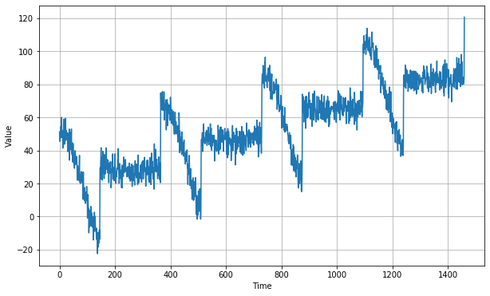
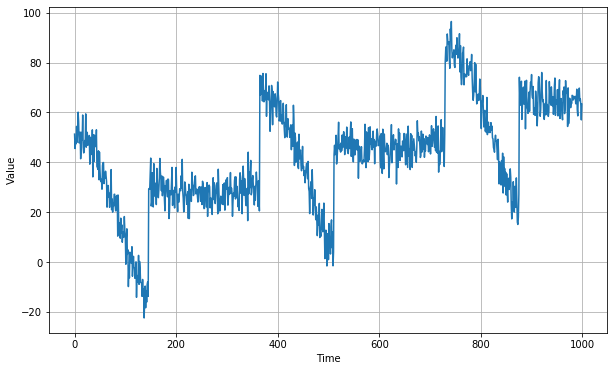
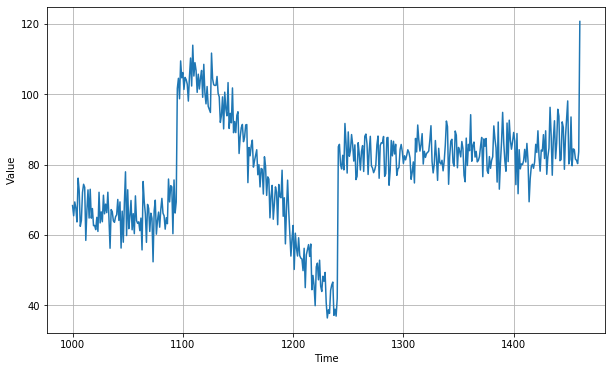
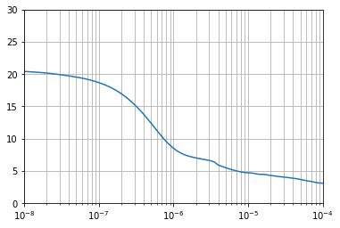
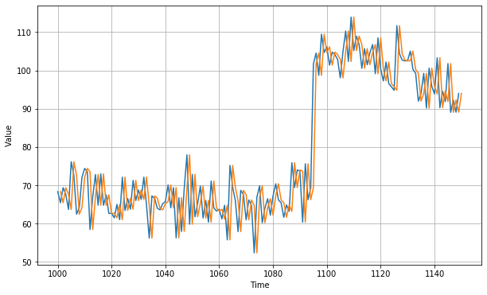
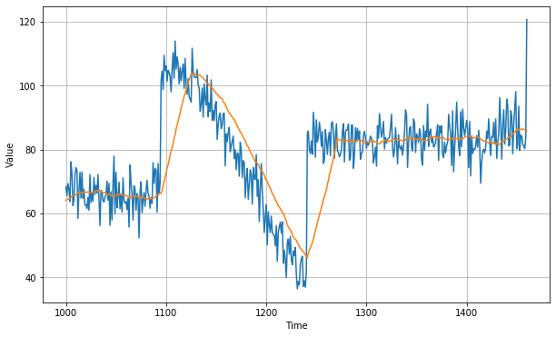
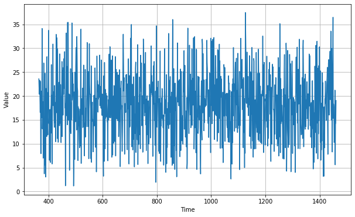
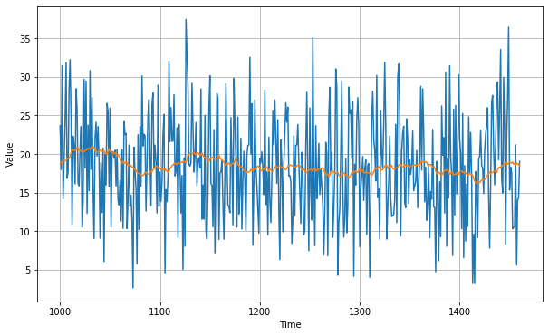
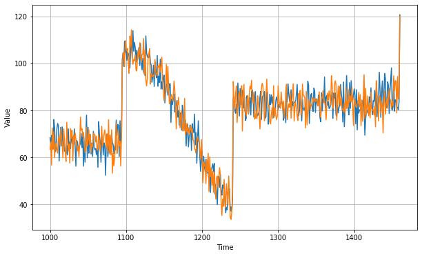
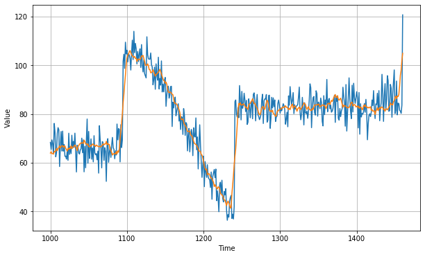

```python
import tensorflow as tf
```


```python
print(tf.__version__)
```

    2.0.0-alpha0
    


```python
import numpy as np
import matplotlib.pyplot as plt
from tensorflow import keras
```


```python
def plot_series(time, series, format = "-", start= 0, end = None):
    plt.plot(time[start:end], series[start:end], format)
    plt.xlabel("Time")
    plt.ylabel("Value")
    plt.grid(True)

def trend(time, slope = 0):
    return slope * time

def seasonal_pattern(season_time):
    return np.where(season_time<0.4,
                    np.cos(season_time * 2* np.pi),
                    1 / np.exp(3*season_time))
def seasonality(time, period, amplitude = 1, phase = 0):
    season_time = ((time + phase) %  period) / period
    return amplitude * seasonal_pattern(season_time)

def noise(time, noise_level =1, seed = None):
    rnd = np.random.RandomState(seed)
    return rnd.randn(len(time)) * noise_level
        
time = np.arange(4*365+1, dtype = 'float32')
baseline = 10
series = trend(time, 0.1)
baseline = 10
amplitude = 40
slope = 0.05
noise_level = 5

series = baseline + trend(time, slope) + seasonality(time, period = 365, amplitude = amplitude)
series += noise(time, noise_level, seed = 43) 

plt.figure(figsize = (10,6))
plot_series(time, series)
plt.show()                    
```





```python
split_time = 1000
time_train = time[: split_time]
x_train = series[: split_time]
time_valid = time[split_time:]
x_valid = series[split_time:]

plt.figure(figsize = (10,6))
plot_series(time_train, x_train)
plt.show()

plt.figure(figsize = (10,6))
plot_series(time_valid, x_valid)
plt.show()
```








# Noive Forecast


```python
naive_forecast = series[split_time -1: -1]
```


```python
plt.figure(figsize =(10,6))
plot_series(time_valid, x_valid)
plot_series(time_valid, naive_forecast)
```





```python
plt.figure(figsize = (10,6))
plot_series(time_valid, x_valid, start = 0, end = 150)
plot_series(time_valid, naive_forecast, start=1, end = 151)
```





```python
print(keras.metrics.mean_squared_error(x_valid, naive_forecast).numpy())
print(keras.metrics.mean_absolute_error(x_valid, naive_forecast).numpy())
```

    55.50221
    5.6658406
    


```python
def moving_average_forecast(series, window_size):
    forecast = []
    for time in range(len(series) - window_size):
        forecast.append(series[time:time+window_size].mean())
    return np.array(forecast)
```


```python
moving_avg = moving_average_forecast(series, 30)[split_time -30:]

plt.figure(figsize = (10,6))
plot_series(time_valid, x_valid)
plot_series(time_valid, moving_avg)
```





```python
print(keras.metrics.mean_squared_error(x_valid, moving_avg).numpy())
print(keras.metrics.mean_absolute_error(x_valid, moving_avg).numpy())
```

    110.2656
    7.3179474
    


```python
diff_series = (series[365:] - series[:-365])
diff_time = time[365:]

plt.figure(figsize = (10,6))
plot_series(diff_time, diff_series)
plt.show()
```





```python
diff_moving_avg = moving_average_forecast(diff_series, 50)[split_time - 365 - 50:]

plt.figure(figsize = (10,6))
plot_series(time_valid, diff_series[split_time - 365:])
plot_series(time_valid, diff_moving_avg)
plt.show()
```





```python
diff_moving_avg_plus_past = series[split_time -365: -365] + diff_moving_avg

plt.figure(figsize = (10,6))
plot_series(time_valid, x_valid)
plot_series(time_valid, diff_moving_avg_plus_past)
plt.show()
```





```python
print(keras.metrics.mean_squared_error(x_valid, diff_moving_avg_plus_past).numpy())
print(keras.metrics.mean_absolute_error(x_valid, diff_moving_avg_plus_past).numpy())
```

    44.843662
    5.4423876
    


```python
diff_moving_avg_plus_smooth_past = moving_average_forecast(series[split_time - 370: -360], 10) + diff_moving_avg

plt.figure(figsize = (10,6))
plot_series(time_valid, x_valid)
plot_series(time_valid, diff_moving_avg_plus_smooth_past)
plt.show()
```





```python
print(keras.metrics.mean_squared_error(x_valid, diff_moving_avg_plus_smooth_past).numpy())
print(keras.metrics.mean_absolute_error(x_valid, diff_moving_avg_plus_smooth_past).numpy())
```

    34.049896
    4.5269456
    
