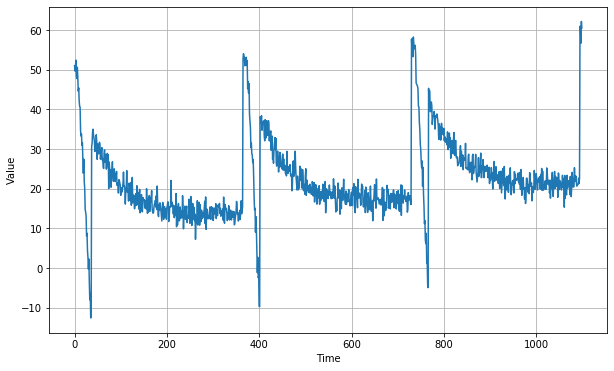
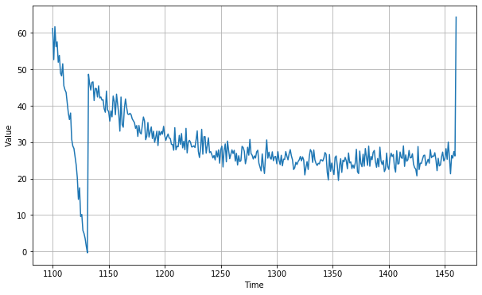
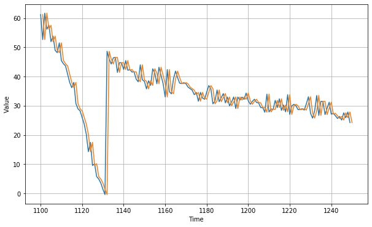
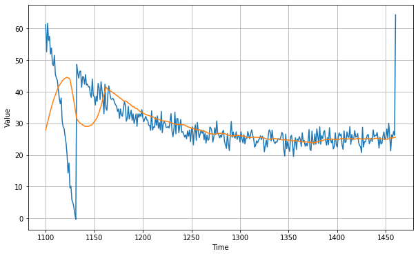
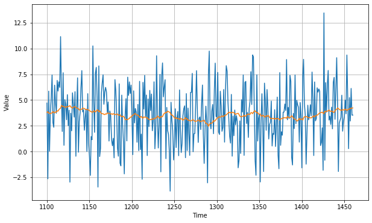
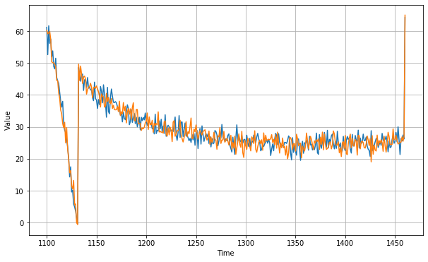
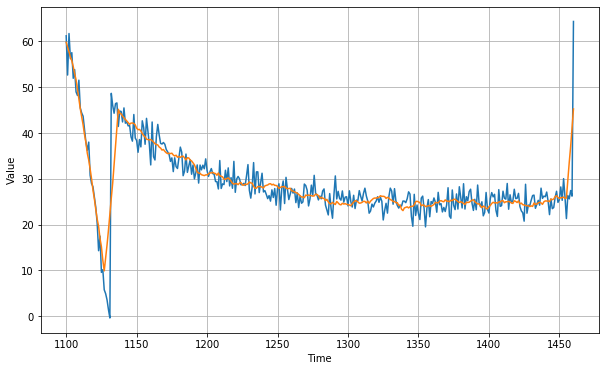

```python
# Tensorflow Deveoper Certification
## Time Series_Exercise_1_Create and predict synthetic data
** tensorflow version: 2.0.0-alpha0 **  
dataset: a corpus of Shakespeare sonnets
data source:  https://www.kaggle.com/datamunge/sign-language-mnist  
Use the dataset and train a model then see if that model can create poetry!
```


```python
import tensorflow as tf
print(tf.__version__)
```

    2.0.0-alpha0
    


```python
import numpy as np
import matplotlib.pyplot as plt
from tensorflow import keras
```

#####  series는 time을 받아서 만들어지는 value이다.


```python
def plot_series(time, series, format = "-", start = 0, end = None):
    plt.plot(time[start:end], series[start:end], format)
    plt.xlabel('Time')
    plt.ylabel('Value')
    plt.grid(True)
    
def trend(time, slope = 0):
    return slope * time

def seasonality(time, period, amplitude = 1, phase = 0):
    season_time = ((time + phase) % period) / period
    return amplitude * seasonal_pattern(season_time)

def seasonal_pattern(season_time): 
    return np.where(season_time < 0.1, 
                   np.cos(season_time * 7 * np.pi), 
                   1 / np.exp(5 * season_time))

def noise(time, noise_level = 1, seed = None):
    rnd = np.random.RandomState(seed)
    return rnd.randn(len(time)) * noise_level

time  = np.arange(4*365 +1, dtype = 'float32')
baseline = 10
series = trend(time, 0.1)
baseline = 10
amplitude = 40
slope = 0.01
noise_level = 2

# create the series

series = baseline + trend(time, slope) + seasonality(time, period = 365, amplitude = amplitude)
# update with noise
series += noise(time, noise_level, seed=42)

plt.figure(figsize =(10,6))
plot_series(time, series)
plt.show()

print(type(series))
print(series)

```


    <class 'numpy.ndarray'>
    [50.993427 49.660896 51.025326 ... 27.43651  26.209599 64.32309 ]
    


```python
split_time = 1100
time_train = time[:split_time]
x_train = series[:split_time]
time_valid = time[split_time: ]
x_valid = series[split_time: ]

plt.figure(figsize = (10,6))
plot_series(time_train, x_train)
plt.show()

plt.figure(figsize = (10,6))
plot_series(time_valid, x_valid)
plt.show()
```








##### naive_forecast는 바로 X축-1 값의 y축의 값으로 얻는 것. slicing 할 때 마지막 range를 -1로 하여 갯수를 맞춰줘야 한다.


```python
naive_forecast = series[split_time -1: -1]
```


```python
plt.figure(figsize=(10, 6))
plot_series(time_valid, x_valid)
plot_series(time_valid, naive_forecast)
```


##### 그냥 위의 graph를 zoom in 하여 보고 싶어서(아래는 그냥 option)


```python
plt.figure(figsize = (10,6))
plot_series(time_valid, x_valid, start = 0, end =150)
plot_series(time_valid, naive_forecast, start=1, end = 151)
```





##### 위를 MSE와 MAE로 error 값을 확인해보자

### this is for reference but very import 
error = forecast = actual \
mse = np.square(errors).mean() \
rmse = np.sqrt(mse) \
mae = np.abs(errors).mean() \
mape = np.abs(errors / x_valid).mean()


```python
print(keras.metrics.mean_squared_error(x_valid, naive_forecast).numpy())
print(keras.metrics.mean_absolute_error(x_valid, naive_forecast).numpy())
```

    19.578304
    2.6011968
    

##### 이번에는 time(x-axis)으로부터 window_size(여기서는 30일)만큼의  범위의 x-axis에 해당하는 value(y-axis) mean을 y-axis에 나타낸다. x-axis의 하나 하나 할 때마다 그 점으로부터 window_size의 mean value가 들어가니까 아무래도 뾰족뾰족한 놈들이 상쇄된다.


```python
def moving_average_forecast(series, window_size):
    forecast = []
    for time in range(len(series)-window_size):
        forecast.append(series[time:time+window_size].mean())
    return np.array(forecast)

moving_avg = moving_average_forecast(series, 30)[split_time-30:]

plt.figure(figsize =(10,6))
plot_series(time_valid, x_valid)
plot_series(time_valid, moving_avg)

print(keras.metrics.mean_squared_error(x_valid, moving_avg).numpy())
print(keras.metrics.mean_absolute_error(x_valid, moving_avg).numpy())
```

    65.786224
    4.3040023
    





##### 바로 위의 moving_average_forecast는 error가 naive forecast보다 크다. 아마 trend나 seasonality가 포함 안되어있기 때문일텐데..differencing(365일 이전의 value와 현재 값의 차이)을 이용해서 봐보자


```python
diff_series = (series[365:] - series[:-365])
diff_time = time[365:]

plt.figure(figsize =(10,6))
plot_series(diff_time, diff_series)
```


```python
len(diff_series)
```


    1096


##### 위를 이용하자. 조금 더 좁은 영역을 봐주는데, moving_averge_forecast는 위의 diff_series를 좀 좁혀주는 것. window_size를 50으로 했다. 좀 더 보자...여기를 잘 모르겠다. 


```python
diff_moving_avg = moving_average_forecast(diff_series, 50)[split_time-365-50:]

plt.figure(figsize =(10,6))
plot_series(time_valid, diff_series[split_time - 365:])
plot_series(time_valid, diff_moving_avg)
plt.show()
```





#### 이 아래부터 먼말인지 모르겠어


```python
diff_moving_avg_plus_past = series[split_time -365: -365] + diff_moving_avg

plt.figure(figsize=(10,6))
plot_series(time_valid, x_valid)
plot_series(time_valid, diff_moving_avg_plus_past)
plt.show()

print(keras.metrics.mean_squared_error(x_valid, diff_moving_avg_plus_past).numpy())
print(keras.metrics.mean_absolute_error(x_valid, diff_moving_avg_plus_past).numpy())
```





    8.498155
    2.327179
    


```python
diff_moving_avg_plus_smooth_past = moving_average_forecast(series[split_time -370: -360], 10) + diff_moving_avg

plt.figure(figsize=(10,6))
plot_series(time_valid, x_valid)
plot_series(time_valid, diff_moving_avg_plus_smooth_past)
plt.show()

print(keras.metrics.mean_squared_error(x_valid, diff_moving_avg_plus_smooth_past).numpy())
print(keras.metrics.mean_absolute_error(x_valid, diff_moving_avg_plus_smooth_past).numpy())
```





    12.527958
    2.2034433
    
