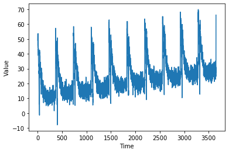
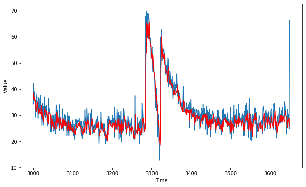

# Tensorflow Deveoper Certification
## Time Series_Exercise_2_Predict with a DNN
** tensorflow version: 2.0.0-alpha0 **  
DNN stands for Deep Neural Network  
Create a DNN to predict values for your series


```python
import tensorflow as tf
import numpy as np
import matplotlib.pyplot as plt
print(tf.__version__)
```

    2.0.0-alpha0
    


```python
def plot_series(time, series, format = "-", start = 0, end = None):
    plt.plot(time[start:end], series[start:end], format)
    plt.xlabel('Time')
    plt.ylabel('Value')
    plt.grid(False)

def trend(time, slope = 0):
    return slope * time

def seasonal_pattern(season_time):
    return np.where(season_time< 0.1, 
                   np.cos(season_time * 6 * np.pi),
                   2 / np.exp(9* season_time))
def seasonality(time, period, amplitude = 1, phase = 0):
    season_time = ((time + phase)% period) / period
    return amplitude * seasonal_pattern(season_time)

def noise(time, noise_level =1, seed = None):
    rnd = np.random.RandomState(seed)
    return rnd.randn(len(time)) * noise_level

time = np.arange(10*365+1, dtype = 'float32')
baseline = 10
series = trend(time, 0.1)
baseline = 10
amplitude = 40
slope = 0.005
noise_level = 3

#create the series
series = baseline + trend(time, slope) +  seasonality(time, period=365, amplitude = amplitude)
#update with noise
series += noise(time, noise_level, seed=51)

split_time = 3000
time_train = time[:split_time]
x_train= series[: split_time]
time_valid = time[split_time:]
x_valid = series[split_time:]

window_size = 20
batch_size = 32
shuffle_buffer_size = 1000

plot_series(time, series)
```





#### 아래로부터 dataset을 feature와 label로 나눈다. 


```python
def windowed_dataset(series, window_size, batch_size, shuffle_buffer):
#   왜 from_rensor_slices 쓰나? 아래에서 window, flat_map, shuffle 등의 필요한 함수를 쓰기 위한 전처리
#   numpy array를 dataset으로 변환한다. 
    dataset = tf.data.Dataset.from_tensor_slices(series)
    
#     왜 window_size+1인가? 다음날 예측값까지 합쳐서 잘라준다. X, y 포함하는 범위까지
    dataset = dataset.window(window_size +1, shift =1, drop_remainder = True)
    
#     to flatten the data (위에 size를 그대로 넘겨주면 된다.)
    dataset = dataset.flat_map(lambda window: window.batch(window_size +1))
    
#     위에서 window_size+1로 잘랐기 때문에 아래서 다시 자른다. 
    dataset = dataset.shuffle(shuffle_buffer).map(lambda window: (window[:-1], window[-1]))    
#     아래로 나태낼 수도 있다. 위처럼 shuffle와 map을 함께 쓰면 먼저 shuffle 하고 그 다음에 map을 한다고 강의에서는 말하네..그런가?
#     dataset = dataset.map(lambda window: (window[:-1], window[-1:]))
#     dataset = dataset.shuffle(buffer_size = 10)
    
    dataset = dataset.batch(batch_size).prefetch(1)
    return dataset
```

#### training neural network with above. 

### below is single layer neural network ---------> Linear regression model


```python
# single layer neural network 

dataset = windowed_dataset(x_train, window_size, batch_size, shuffle_buffer_size)
l0 = tf.keras.layers.Dense(1, input_shape = [window_size])
model = tf.keras.models.Sequential([l0])

# SGD = Stochastic Gradient Descent
# lr = learning_rate 
model.compile(loss = 'mse', optimizer = tf.keras.optimizers.SGD(lr = 1e-6, momentum = 0.9))
model.fit(dataset, epochs = 100, verbose = 0)

print('Layer weights {}'.format(l0.get_weights()))
```

    Layer weights [array([[ 0.02621953],
           [ 0.06042188],
           [-0.05003921],
           [-0.01748204],
           [ 0.01313776],
           [ 0.00724837],
           [-0.02181854],
           [ 0.04241999],
           [-0.03944828],
           [-0.02367361],
           [ 0.04519312],
           [-0.03551989],
           [ 0.03753696],
           [-0.01911706],
           [-0.02578371],
           [ 0.02531768],
           [ 0.04106133],
           [ 0.07825848],
           [ 0.22949502],
           [ 0.60582995]], dtype=float32), array([0.04376812], dtype=float32)]
    

### below is multi layer neural network -----------> Deep neural network model


```python
dataset = windowed_dataset(x_train, window_size, batch_size, shuffle_buffer_size)

model = tf.keras.models.Sequential([
    tf.keras.layers.Dense(100, input_shape = [window_size], activation = 'relu'),
    tf.keras.layers.Dense(10, activation = 'relu'),
    tf.keras.layers.Dense(1)
])
model.compile(loss = 'mse', optimizer = tf.keras.optimizers.SGD(lr = 1e-6, momentum = 0.9))
model.fit(dataset, epochs = 100, verbose = 0)

```


    <tensorflow.python.keras.callbacks.History at 0x2ad4be36d88>


#### blue : actual value 
#### red: predicted value


```python
forecast  = []
for time in range(len(series) - window_size):
    forecast.append(model.predict(series[time:time + window_size][np.newaxis]))
forecast = forecast[split_time-window_size:]
results = np.array(forecast)[:, 0, 0]

plt.figure(figsize = (10, 6))
plot_series(time_valid, x_valid)
plot_series(time_valid, results, 'r')

tf.keras.metrics.mean_absolute_error(x_valid, results).numpy()
# Expected output is  ""< 3""
```


    3.1047604





### dataset example just for reference


```python
dataset_1 = tf.data.Dataset.range(10)
print(type(dataset_1))

# data
for val in dataset_1: 
    print(val.numpy())
```

    <class 'tensorflow.python.data.ops.dataset_ops.RangeDataset'>
    0
    1
    2
    3
    4
    5
    6
    7
    8
    9
    
