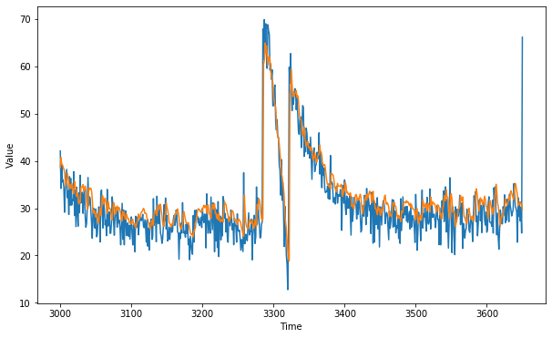
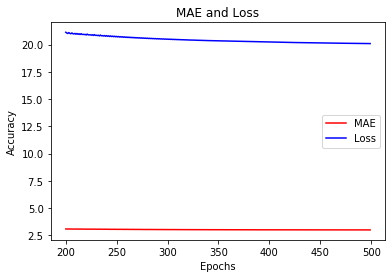

# Tensorflow Deveoper Certification
## Time Series_Exercise_3_Mean Absolute Error
** tensorflow version: 2.0.0-alpha0 **  
synthetic data set use and write the code to pick the learning rate  
Train on it to get an MAE of < 3


```python
import tensorflow as tf
import numpy as np
import matplotlib.pyplot as plt

```


```python
def plot_series(time, series, format = '-', start = 0, end = None):
    plt.plot(time[start:end], series[start:end], format)
    plt.xlabel('Time')
    plt.ylabel('Value')
    plt.grid(False)
    
def trend(time, slope = 0):
    return slope * time

def seasonal_pattern(season_time):
    return np.where(season_time < 0.1, 
                   np.cos(season_time *6 * np.pi), 
                   2 / np.exp(9*season_time))
def seasonality(time, period, amplitude = 1, phase = 0):
    season_time = ((time + phase) % period) / period
    return amplitude * seasonal_pattern(season_time)

def noise(time, noise_level = 1, seed = None):
    rnd  = np.random.RandomState(seed)
    return rnd.randn(len(time)) * noise_level

time = np.arange(10*365 +1, dtype = 'float32')
baseline = 10
series = trend(time, 0.1)
baseline = 10
amplitude = 40
slope = 0.005
noise_level = 3

series = baseline + trend(time, slope) + seasonality(time, period = 365, amplitude = amplitude)

series += noise(time, noise_level, seed=51)

split_time = 3000
time_train = time[:split_time]
x_train = series[:split_time]
time_valid = time[split_time:]
x_valid = series[split_time:]

window_size = 20
batch_size = 32
shuffle_buffer_size = 1000

plot_series(time, series)
```


#### data pipeline 구축한다.  
tf.data.Dataset이라는 Dataset class를 사용한다.  
window size = 5는 5일치 data를 train으로 사용한다.  


```python
def windowed_dataset(series, window_size, batch_size, shuffle_buffer):
    dataset = tf.data.Dataset.from_tensor_slices(series)
    dataset = dataset.window(window_size + 1, shift = 1, drop_remainder = True)
    
    #  결과를 flat하게 준다. 예를 들어 2차원을 1차원으로 준다. 
    dataset = dataset.flat_map(lambda window: window.batch(window_size + 1))
    dataset = dataset.shuffle(shuffle_buffer).map(lambda window: (window[:-1], window[-1]))
    
    # prefetch는 미리 data를 fetch하는 개수 ==> 학습 속도를 개선시키는 효과가 있다. 
    dataset = dataset.batch(batch_size).prefetch(1)
    return dataset   
```

 the data from earlier in the window can have a greater impact on the overall projection than in the case of RNNs. 


```python
tf.keras.backend.clear_session()   # this clears any internal variables
tf.random.set_seed(51)
np.random.seed(51)

tf.keras.backend.clear_session()
dataset = windowed_dataset(x_train, window_size, batch_size, shuffle_buffer_size)

model = tf.keras.models.Sequential([
    tf.keras.layers.Lambda(lambda x: tf.expand_dims(x, axis =-1), input_shape = [None]), 
    tf.keras.layers.Bidirectional(tf.keras.layers.LSTM(32, return_sequences = True)), 
    tf.keras.layers.Bidirectional(tf.keras.layers.LSTM(32)), 
    tf.keras.layers.Dense(1),
    tf.keras.layers.Lambda(lambda x: x * 10.0)
])

# based  on the epoch number, lr changes 
lr_schedule  =tf.keras.callbacks.LearningRateScheduler(lambda epoch: 1e-8 * 10 **(epoch/20))


optimizer = tf.keras.optimizers.SGD(lr=1e-8, momentum = 0.9)
model.compile(loss = tf.keras.losses.Huber(), optimizer = optimizer, metrics = ['mae'])
history = model.fit(dataset, epochs = 100, callbacks = [lr_schedule])
```

    Epoch 1/100
    94/94 [==============================] - 7s 76ms/step - loss: 20.5121 - mae: 20.8828
    Epoch 2/100
    94/94 [==============================] - 2s 26ms/step - loss: 20.4822 - mae: 20.8543: 1s - loss
    Epoch 3/100
    94/94 [==============================] - 2s 26ms/step - loss: 20.4497 - mae: 20.8218
    Epoch 4/100
    94/94 [==============================] - 3s 29ms/step - loss: 20.4130 - mae: 20.7851
    Epoch 5/100
    94/94 [==============================] - 2s 25ms/step - loss: 20.3714 - mae: 20.7436
    Epoch 6/100
    94/94 [==============================] - 2s 26ms/step - loss: 20.3242 - mae: 20.6964
    Epoch 7/100
    94/94 [==============================] - 2s 26ms/step - loss: 20.2706 - mae: 20.6429
    Epoch 8/100
    94/94 [==============================] - 3s 28ms/step - loss: 20.2098 - mae: 20.5822
    Epoch 9/100
    94/94 [==============================] - 3s 30ms/step - loss: 20.1414 - mae: 20.5139
    Epoch 10/100
    94/94 [==============================] - 3s 30ms/step - loss: 20.0659 - mae: 20.4384
    Epoch 11/100
    94/94 [==============================] - 3s 33ms/step - loss: 19.9858 - mae: 20.3584
    Epoch 12/100
    94/94 [==============================] - 3s 28ms/step - loss: 19.9050 - mae: 20.2777
    Epoch 13/100
    94/94 [==============================] - 3s 30ms/step - loss: 19.8240 - mae: 20.1967
    Epoch 14/100
    94/94 [==============================] - 3s 27ms/step - loss: 19.7381 - mae: 20.1109
    Epoch 15/100
    94/94 [==============================] - 3s 28ms/step - loss: 19.6434 - mae: 20.0163
    Epoch 16/100
    94/94 [==============================] - 3s 31ms/step - loss: 19.5379 - mae: 19.9108: 0s - loss: 18.0386 
    Epoch 17/100
    94/94 [==============================] - 4s 42ms/step - loss: 19.4203 - mae: 19.7932
    Epoch 18/100
    94/94 [==============================] - 3s 37ms/step - loss: 19.2888 - mae: 19.6618
    Epoch 19/100
    94/94 [==============================] - 3s 35ms/step - loss: 19.1418 - mae: 19.5149
    Epoch 20/100
    94/94 [==============================] - 3s 36ms/step - loss: 18.9772 - mae: 19.3503
    Epoch 21/100
    94/94 [==============================] - 3s 34ms/step - loss: 18.7926 - mae: 19.1657
    Epoch 22/100
    94/94 [==============================] - 3s 36ms/step - loss: 18.5854 - mae: 18.9584
    Epoch 23/100
    94/94 [==============================] - 3s 35ms/step - loss: 18.3523 - mae: 18.7251: 1s - los
    Epoch 24/100
    94/94 [==============================] - 3s 36ms/step - loss: 18.0897 - mae: 18.4624
    Epoch 25/100
    94/94 [==============================] - 3s 34ms/step - loss: 17.7933 - mae: 18.1659
    Epoch 26/100
    94/94 [==============================] - 3s 35ms/step - loss: 17.4589 - mae: 17.8317
    Epoch 27/100
    94/94 [==============================] - 4s 39ms/step - loss: 17.0827 - mae: 17.4559: 2s -
    Epoch 28/100
    94/94 [==============================] - 3s 33ms/step - loss: 16.6627 - mae: 17.0362: 1s - loss: 14.
    Epoch 29/100
    94/94 [==============================] - 3s 33ms/step - loss: 16.1987 - mae: 16.5722
    Epoch 30/100
    94/94 [==============================] - 3s 33ms/step - loss: 15.6909 - mae: 16.0642
    Epoch 31/100
    94/94 [==============================] - 3s 34ms/step - loss: 15.1390 - mae: 15.5119
    Epoch 32/100
    94/94 [==============================] - 3s 35ms/step - loss: 14.5423 - mae: 14.9154
    Epoch 33/100
    94/94 [==============================] - 3s 36ms/step - loss: 13.9008 - mae: 14.2738: 0s - loss: 13.1468 - m
    Epoch 34/100
    94/94 [==============================] - 3s 35ms/step - loss: 13.2187 - mae: 13.5903
    Epoch 35/100
    94/94 [==============================] - 3s 36ms/step - loss: 12.5063 - mae: 12.8763
    Epoch 36/100
    94/94 [==============================] - 3s 35ms/step - loss: 11.7799 - mae: 12.1493
    Epoch 37/100
    94/94 [==============================] - 3s 35ms/step - loss: 11.0548 - mae: 11.4261
    Epoch 38/100
    94/94 [==============================] - 4s 38ms/step - loss: 10.3480 - mae: 10.7180
    Epoch 39/100
    94/94 [==============================] - 3s 37ms/step - loss: 9.6888 - mae: 10.0574
    Epoch 40/100
    94/94 [==============================] - 3s 35ms/step - loss: 9.1046 - mae: 9.4763: 0s - loss: 8.8336 - mae: 
    Epoch 41/100
    94/94 [==============================] - 3s 35ms/step - loss: 8.6019 - mae: 8.9766
    Epoch 42/100
    94/94 [==============================] - 3s 35ms/step - loss: 8.1799 - mae: 8.5587
    Epoch 43/100
    94/94 [==============================] - 3s 33ms/step - loss: 7.8391 - mae: 8.2200
    Epoch 44/100
    94/94 [==============================] - 3s 34ms/step - loss: 7.5752 - mae: 7.9594
    Epoch 45/100
    94/94 [==============================] - 4s 40ms/step - loss: 7.3736 - mae: 7.7614
    Epoch 46/100
    94/94 [==============================] - 4s 38ms/step - loss: 7.2159 - mae: 7.6073
    Epoch 47/100
    94/94 [==============================] - 4s 41ms/step - loss: 7.0868 - mae: 7.4794
    Epoch 48/100
    94/94 [==============================] - 3s 37ms/step - loss: 6.9748 - mae: 7.3678
    Epoch 49/100
    94/94 [==============================] - 3s 36ms/step - loss: 6.8686 - mae: 7.2622
    Epoch 50/100
    94/94 [==============================] - 3s 35ms/step - loss: 6.7591 - mae: 7.1534
    Epoch 51/100
    94/94 [==============================] - 3s 36ms/step - loss: 6.6365 - mae: 7.0309
    Epoch 52/100
    94/94 [==============================] - 4s 37ms/step - loss: 6.4336 - mae: 6.8258
    Epoch 53/100
    94/94 [==============================] - 3s 37ms/step - loss: 5.9699 - mae: 6.3533
    Epoch 54/100
    94/94 [==============================] - 3s 37ms/step - loss: 5.7730 - mae: 6.1570
    Epoch 55/100
    94/94 [==============================] - 4s 45ms/step - loss: 5.5697 - mae: 5.9520
    Epoch 56/100
    94/94 [==============================] - 3s 34ms/step - loss: 5.3743 - mae: 5.7533
    Epoch 57/100
    94/94 [==============================] - 3s 36ms/step - loss: 5.2037 - mae: 5.5832
    Epoch 58/100
    94/94 [==============================] - 3s 35ms/step - loss: 5.0553 - mae: 5.4325
    Epoch 59/100
    94/94 [==============================] - 3s 36ms/step - loss: 4.9181 - mae: 5.2958
    Epoch 60/100
    94/94 [==============================] - 3s 34ms/step - loss: 4.8254 - mae: 5.2030
    Epoch 61/100
    94/94 [==============================] - 3s 34ms/step - loss: 4.7633 - mae: 5.1414
    Epoch 62/100
    94/94 [==============================] - 3s 33ms/step - loss: 4.7403 - mae: 5.1174
    Epoch 63/100
    94/94 [==============================] - 3s 37ms/step - loss: 4.6225 - mae: 5.0035
    Epoch 64/100
    94/94 [==============================] - 3s 34ms/step - loss: 4.5346 - mae: 4.9191
    Epoch 65/100
    94/94 [==============================] - 3s 34ms/step - loss: 4.5217 - mae: 4.9148
    Epoch 66/100
    94/94 [==============================] - 3s 34ms/step - loss: 4.4580 - mae: 4.8540
    Epoch 67/100
    94/94 [==============================] - 3s 36ms/step - loss: 4.3487 - mae: 4.7386: 0s - loss: 4.2447 - ma
    Epoch 68/100
    94/94 [==============================] - 4s 38ms/step - loss: 4.2742 - mae: 4.6633
    Epoch 69/100
    94/94 [==============================] - 3s 34ms/step - loss: 4.1996 - mae: 4.5918
    Epoch 70/100
    94/94 [==============================] - 3s 35ms/step - loss: 4.1285 - mae: 4.5233
    Epoch 71/100
    94/94 [==============================] - 3s 34ms/step - loss: 4.0718 - mae: 4.4664: 1s - loss: 3.9328 - mae:  - ETA: 0s - loss: 3.9904 -
    Epoch 72/100
    94/94 [==============================] - 3s 35ms/step - loss: 3.9948 - mae: 4.3899: 0s - loss: 3.9110 - mae:
    Epoch 73/100
    94/94 [==============================] - 3s 34ms/step - loss: 3.9212 - mae: 4.3143
    Epoch 74/100
    94/94 [==============================] - 3s 35ms/step - loss: 3.8412 - mae: 4.2338
    Epoch 75/100
    94/94 [==============================] - 4s 40ms/step - loss: 3.7183 - mae: 4.1160
    Epoch 76/100
    94/94 [==============================] - 3s 34ms/step - loss: 3.6124 - mae: 4.0152
    Epoch 77/100
    94/94 [==============================] - 3s 34ms/step - loss: 3.4729 - mae: 3.8833
    Epoch 78/100
    94/94 [==============================] - 3s 33ms/step - loss: 3.3898 - mae: 3.8017
    Epoch 79/100
    94/94 [==============================] - 3s 35ms/step - loss: 3.2607 - mae: 3.6675
    Epoch 80/100
    94/94 [==============================] - 3s 35ms/step - loss: 3.1747 - mae: 3.5816
    Epoch 81/100
    94/94 [==============================] - 3s 35ms/step - loss: 3.1387 - mae: 3.5435
    Epoch 82/100
    94/94 [==============================] - 4s 38ms/step - loss: 3.0668 - mae: 3.4718
    Epoch 83/100
    94/94 [==============================] - 3s 36ms/step - loss: 3.0631 - mae: 3.4674
    Epoch 84/100
    94/94 [==============================] - 3s 35ms/step - loss: 2.9895 - mae: 3.3919
    Epoch 85/100
    94/94 [==============================] - 3s 33ms/step - loss: 3.0249 - mae: 3.4270
    Epoch 86/100
    94/94 [==============================] - ETA: 0s - loss: 2.9512 - mae: 3.4127- ETA: 1s - lo - ETA: 0s - loss: 2.9580 - mae: 3.4 - 3s 32ms/step - loss: 3.0118 - mae: 3.4120
    Epoch 87/100
    94/94 [==============================] - 3s 32ms/step - loss: 2.9802 - mae: 3.3834
    Epoch 88/100
    94/94 [==============================] - 3s 32ms/step - loss: 2.9982 - mae: 3.3996
    Epoch 89/100
    94/94 [==============================] - 3s 34ms/step - loss: 3.0188 - mae: 3.4192
    Epoch 90/100
    94/94 [==============================] - 3s 31ms/step - loss: 2.9989 - mae: 3.3999
    Epoch 91/100
    94/94 [==============================] - 3s 31ms/step - loss: 2.9755 - mae: 3.3754
    Epoch 92/100
    94/94 [==============================] - 3s 34ms/step - loss: 2.9597 - mae: 3.3575
    Epoch 93/100
    94/94 [==============================] - 4s 45ms/step - loss: 2.9285 - mae: 3.3312
    Epoch 94/100
    94/94 [==============================] - 3s 36ms/step - loss: 2.9965 - mae: 3.3974
    Epoch 95/100
    94/94 [==============================] - 3s 35ms/step - loss: 3.0097 - mae: 3.4144
    Epoch 96/100
    94/94 [==============================] - 3s 35ms/step - loss: 2.8086 - mae: 3.2096
    Epoch 97/100
    94/94 [==============================] - 3s 34ms/step - loss: 2.8579 - mae: 3.2619
    Epoch 98/100
    94/94 [==============================] - 4s 47ms/step - loss: 2.9719 - mae: 3.3744
    Epoch 99/100
    94/94 [==============================] - 3s 37ms/step - loss: 2.8707 - mae: 3.2755
    Epoch 100/100
    94/94 [==============================] - 3s 34ms/step - loss: 2.9779 - mae: 3.3866
    


```python
plt.semilogx(history.history['lr'], history.history['loss'])
plt.axis([1e-8, 1e-4, 0, 30])
plt.grid(b = True, which = 'both', axis = 'both')
```


```python
tf.keras.backend.clear_session()
tf.random.set_seed(51)
np.random.seed(51)

tf.keras.backend.clear_session()
dataset = windowed_dataset(x_train, window_size, batch_size, shuffle_buffer_size)

model = tf.keras.models.Sequential([
    tf.keras.layers.Lambda(lambda x: tf.expand_dims(x, axis=-1), 
                          input_shape = [None]), 
    tf.keras.layers.Bidirectional(tf.keras.layers.LSTM(32, return_sequences = True)), 
    tf.keras.layers.Bidirectional(tf.keras.layers.LSTM(32)), 
    tf.keras.layers.Dense(1), 
    tf.keras.layers.Lambda(lambda x: x * 100.0)
])
model.compile(loss = 'mse', optimizer = tf.keras.optimizers.SGD(lr=1e-5, momentum = 0.9), metrics = ['mae'])
history = model.fit(dataset, epochs = 500, verbose = 1)
              
```

    Epoch 1/500
    94/94 [==============================] - 8s 83ms/step - loss: 317.3266 - mae: 10.6099
    Epoch 2/500
    94/94 [==============================] - 3s 30ms/step - loss: 43.9131 - mae: 4.3734
    Epoch 3/500
    94/94 [==============================] - 4s 39ms/step - loss: 38.1663 - mae: 4.0789
    Epoch 4/500
    94/94 [==============================] - 3s 27ms/step - loss: 35.4674 - mae: 3.9329
    Epoch 5/500
    94/94 [==============================] - 2s 25ms/step - loss: 34.3146 - mae: 3.8666
    Epoch 6/500
    94/94 [==============================] - 2s 25ms/step - loss: 35.0763 - mae: 3.9453
    Epoch 7/500
    94/94 [==============================] - 2s 25ms/step - loss: 32.9887 - mae: 3.7930
    Epoch 8/500
    94/94 [==============================] - 2s 25ms/step - loss: 33.0334 - mae: 3.8177
    Epoch 9/500
    94/94 [==============================] - 2s 25ms/step - loss: 31.9545 - mae: 3.7345
    Epoch 10/500
    94/94 [==============================] - 2s 24ms/step - loss: 31.5508 - mae: 3.7091
    Epoch 11/500
    94/94 [==============================] - 2s 25ms/step - loss: 31.1413 - mae: 3.6787
    Epoch 12/500
    94/94 [==============================] - 2s 25ms/step - loss: 30.8509 - mae: 3.6543
    Epoch 13/500
    94/94 [==============================] - 2s 25ms/step - loss: 30.6272 - mae: 3.6355
    Epoch 14/500
    94/94 [==============================] - 2s 25ms/step - loss: 30.3973 - mae: 3.6174
    Epoch 15/500
    94/94 [==============================] - 2s 26ms/step - loss: 30.1500 - mae: 3.6011
    Epoch 16/500
    94/94 [==============================] - 2s 25ms/step - loss: 29.9113 - mae: 3.5892
    Epoch 17/500
    94/94 [==============================] - 2s 25ms/step - loss: 29.7562 - mae: 3.5830
    Epoch 18/500
    94/94 [==============================] - 2s 25ms/step - loss: 29.6475 - mae: 3.5781
    Epoch 19/500
    94/94 [==============================] - 2s 25ms/step - loss: 29.5469 - mae: 3.5734
    Epoch 20/500
    94/94 [==============================] - 2s 25ms/step - loss: 29.4719 - mae: 3.5719
    Epoch 21/500
    94/94 [==============================] - 2s 25ms/step - loss: 29.4321 - mae: 3.5725
    Epoch 22/500
    94/94 [==============================] - 2s 25ms/step - loss: 29.4229 - mae: 3.5742
    Epoch 23/500
    94/94 [==============================] - 2s 25ms/step - loss: 29.4267 - mae: 3.5779
    Epoch 24/500
    94/94 [==============================] - 2s 25ms/step - loss: 29.4382 - mae: 3.5822
    Epoch 25/500
    94/94 [==============================] - 2s 25ms/step - loss: 29.5223 - mae: 3.5912
    Epoch 26/500
    94/94 [==============================] - 2s 25ms/step - loss: 29.6347 - mae: 3.6010 0s - loss: 26.8979 -
    Epoch 27/500
    94/94 [==============================] - 2s 26ms/step - loss: 29.6155 - mae: 3.5992
    Epoch 28/500
    94/94 [==============================] - 3s 27ms/step - loss: 29.5391 - mae: 3.5931
    Epoch 29/500
    94/94 [==============================] - 2s 25ms/step - loss: 29.4527 - mae: 3.5858
    Epoch 30/500
    94/94 [==============================] - 2s 26ms/step - loss: 29.3841 - mae: 3.5799
    Epoch 31/500
    94/94 [==============================] - 2s 25ms/step - loss: 29.4006 - mae: 3.5841
    Epoch 32/500
    94/94 [==============================] - 2s 26ms/step - loss: 29.2876 - mae: 3.5746
    Epoch 33/500
    94/94 [==============================] - 2s 25ms/step - loss: 29.3532 - mae: 3.5877
    Epoch 34/500
    94/94 [==============================] - 2s 26ms/step - loss: 29.1492 - mae: 3.5642
    Epoch 35/500
    94/94 [==============================] - 2s 25ms/step - loss: 29.2015 - mae: 3.5674
    Epoch 36/500
    94/94 [==============================] - 2s 26ms/step - loss: 29.1970 - mae: 3.5718
    Epoch 37/500
    94/94 [==============================] - 2s 26ms/step - loss: 29.0993 - mae: 3.5567
    Epoch 38/500
    94/94 [==============================] - 2s 26ms/step - loss: 28.9917 - mae: 3.5437
    Epoch 39/500
    94/94 [==============================] - 2s 26ms/step - loss: 28.8653 - mae: 3.5254
    Epoch 40/500
    94/94 [==============================] - 2s 26ms/step - loss: 28.7841 - mae: 3.5152
    Epoch 41/500
    94/94 [==============================] - 2s 25ms/step - loss: 28.6569 - mae: 3.5005
    Epoch 42/500
    94/94 [==============================] - 2s 26ms/step - loss: 28.5466 - mae: 3.4886
    Epoch 43/500
    94/94 [==============================] - 2s 26ms/step - loss: 28.4455 - mae: 3.4774
    Epoch 44/500
    94/94 [==============================] - 2s 26ms/step - loss: 28.3408 - mae: 3.4665
    Epoch 45/500
    94/94 [==============================] - 2s 26ms/step - loss: 28.2470 - mae: 3.4572
    Epoch 46/500
    94/94 [==============================] - 2s 26ms/step - loss: 28.1524 - mae: 3.4479
    Epoch 47/500
    94/94 [==============================] - 2s 26ms/step - loss: 28.0586 - mae: 3.4390
    Epoch 48/500
    94/94 [==============================] - 4s 38ms/step - loss: 27.9657 - mae: 3.4302
    Epoch 49/500
    94/94 [==============================] - 5s 53ms/step - loss: 27.8739 - mae: 3.4218
    Epoch 50/500
    94/94 [==============================] - 5s 49ms/step - loss: 27.7837 - mae: 3.4138
    Epoch 51/500
    94/94 [==============================] - 5s 49ms/step - loss: 27.6952 - mae: 3.4059
    Epoch 52/500
    94/94 [==============================] - 4s 48ms/step - loss: 27.6085 - mae: 3.3983
    Epoch 53/500
    94/94 [==============================] - 4s 44ms/step - loss: 27.5238 - mae: 3.3909
    Epoch 54/500
    94/94 [==============================] - 4s 47ms/step - loss: 27.4412 - mae: 3.3837
    Epoch 55/500
    94/94 [==============================] - 4s 38ms/step - loss: 27.3606 - mae: 3.3768
    Epoch 56/500
    94/94 [==============================] - 3s 34ms/step - loss: 27.2821 - mae: 3.3701
    Epoch 57/500
    94/94 [==============================] - 4s 46ms/step - loss: 27.2058 - mae: 3.3636
    Epoch 58/500
    94/94 [==============================] - 4s 42ms/step - loss: 27.1316 - mae: 3.3573
    Epoch 59/500
    94/94 [==============================] - 4s 39ms/step - loss: 27.0594 - mae: 3.3511
    Epoch 60/500
    94/94 [==============================] - 3s 34ms/step - loss: 26.9893 - mae: 3.3452
    Epoch 61/500
    94/94 [==============================] - 4s 41ms/step - loss: 26.9211 - mae: 3.3395
    Epoch 62/500
    94/94 [==============================] - 4s 37ms/step - loss: 26.8547 - mae: 3.3340
    Epoch 63/500
    94/94 [==============================] - 3s 32ms/step - loss: 26.7901 - mae: 3.3287
    Epoch 64/500
    94/94 [==============================] - 3s 33ms/step - loss: 26.7272 - mae: 3.3236
    Epoch 65/500
    94/94 [==============================] - 3s 33ms/step - loss: 26.6660 - mae: 3.3188
    Epoch 66/500
    94/94 [==============================] - 3s 34ms/step - loss: 26.6064 - mae: 3.3141
    Epoch 67/500
    94/94 [==============================] - 3s 33ms/step - loss: 26.5483 - mae: 3.3097 0s -
    Epoch 68/500
    94/94 [==============================] - 3s 33ms/step - loss: 26.4919 - mae: 3.3055
    Epoch 69/500
    94/94 [==============================] - 3s 33ms/step - loss: 26.4371 - mae: 3.3015
    Epoch 70/500
    94/94 [==============================] - 3s 31ms/step - loss: 26.3842 - mae: 3.2977
    Epoch 71/500
    94/94 [==============================] - 3s 33ms/step - loss: 26.3334 - mae: 3.2942
    Epoch 72/500
    94/94 [==============================] - 3s 34ms/step - loss: 26.2852 - mae: 3.2908 0s - l
    Epoch 73/500
    94/94 [==============================] - 3s 33ms/step - loss: 26.2404 - mae: 3.2878
    Epoch 74/500
    94/94 [==============================] - 3s 32ms/step - loss: 26.1975 - mae: 3.2848
    Epoch 75/500
    94/94 [==============================] - 3s 32ms/step - loss: 26.1497 - mae: 3.2811
    Epoch 76/500
    94/94 [==============================] - 3s 33ms/step - loss: 26.1005 - mae: 3.2776
    Epoch 77/500
    94/94 [==============================] - 3s 35ms/step - loss: 26.0535 - mae: 3.2743
    Epoch 78/500
    94/94 [==============================] - 3s 32ms/step - loss: 26.0086 - mae: 3.2711
    Epoch 79/500
    94/94 [==============================] - 3s 36ms/step - loss: 25.9662 - mae: 3.2682
    Epoch 80/500
    94/94 [==============================] - 3s 32ms/step - loss: 25.9272 - mae: 3.2655
    Epoch 81/500
    94/94 [==============================] - 3s 35ms/step - loss: 25.8917 - mae: 3.2631
    Epoch 82/500
    94/94 [==============================] - 3s 32ms/step - loss: 25.8565 - mae: 3.2608
    Epoch 83/500
    94/94 [==============================] - 3s 32ms/step - loss: 25.8191 - mae: 3.2583
    Epoch 84/500
    94/94 [==============================] - 3s 34ms/step - loss: 25.7823 - mae: 3.2560
    Epoch 85/500
    94/94 [==============================] - 3s 31ms/step - loss: 25.7452 - mae: 3.2535
    Epoch 86/500
    94/94 [==============================] - 3s 29ms/step - loss: 25.7079 - mae: 3.2511
    Epoch 87/500
    94/94 [==============================] - 3s 29ms/step - loss: 25.6697 - mae: 3.2485
    Epoch 88/500
    94/94 [==============================] - 3s 31ms/step - loss: 25.6305 - mae: 3.2458
    Epoch 89/500
    94/94 [==============================] - 3s 30ms/step - loss: 25.5976 - mae: 3.2439 
    Epoch 90/500
    94/94 [==============================] - 3s 31ms/step - loss: 25.6663 - mae: 3.2499
    Epoch 91/500
    94/94 [==============================] - 3s 30ms/step - loss: 25.4246 - mae: 3.2309
    Epoch 92/500
    94/94 [==============================] - 3s 31ms/step - loss: 25.5075 - mae: 3.2387
    Epoch 93/500
    94/94 [==============================] - 3s 32ms/step - loss: 25.5491 - mae: 3.2424
    Epoch 94/500
    94/94 [==============================] - 3s 31ms/step - loss: 25.2794 - mae: 3.2208
    Epoch 95/500
    94/94 [==============================] - 3s 30ms/step - loss: 25.3938 - mae: 3.2311
    Epoch 96/500
    94/94 [==============================] - 3s 29ms/step - loss: 25.4222 - mae: 3.2340 0s - loss: 22. - ETA: 0s - loss: 22.5221 - mae: 3.22
    Epoch 97/500
    94/94 [==============================] - 3s 32ms/step - loss: 25.1861 - mae: 3.2146
    Epoch 98/500
    94/94 [==============================] - 3s 30ms/step - loss: 25.2927 - mae: 3.2242
    Epoch 99/500
    94/94 [==============================] - 3s 31ms/step - loss: 25.3023 - mae: 3.2260
    Epoch 100/500
    94/94 [==============================] - 3s 30ms/step - loss: 25.1009 - mae: 3.2087
    Epoch 101/500
    94/94 [==============================] - 3s 29ms/step - loss: 25.2269 - mae: 3.2205
    Epoch 102/500
    94/94 [==============================] - 3s 30ms/step - loss: 25.1002 - mae: 3.2095
    Epoch 103/500
    94/94 [==============================] - 3s 31ms/step - loss: 25.2664 - mae: 3.2262
    Epoch 104/500
    94/94 [==============================] - 3s 31ms/step - loss: 24.9164 - mae: 3.1941
    Epoch 105/500
    94/94 [==============================] - 3s 29ms/step - loss: 25.1535 - mae: 3.2171
    Epoch 106/500
    94/94 [==============================] - 3s 29ms/step - loss: 24.9276 - mae: 3.1959
    Epoch 107/500
    94/94 [==============================] - 3s 29ms/step - loss: 25.0783 - mae: 3.2113
    Epoch 108/500
    94/94 [==============================] - 3s 30ms/step - loss: 24.9069 - mae: 3.1947
    Epoch 109/500
    94/94 [==============================] - 3s 30ms/step - loss: 25.0443 - mae: 3.2097
    Epoch 110/500
    94/94 [==============================] - 3s 36ms/step - loss: 24.8153 - mae: 3.1871
    Epoch 111/500
    94/94 [==============================] - 4s 43ms/step - loss: 24.9429 - mae: 3.1994
    Epoch 112/500
    94/94 [==============================] - 4s 39ms/step - loss: 24.9549 - mae: 3.2035
    Epoch 113/500
    94/94 [==============================] - 4s 44ms/step - loss: 24.7396 - mae: 3.1813
    Epoch 114/500
    94/94 [==============================] - 3s 31ms/step - loss: 24.8585 - mae: 3.1926
    Epoch 115/500
    94/94 [==============================] - 3s 32ms/step - loss: 24.8395 - mae: 3.1918 0s - loss: 21.4100
    Epoch 116/500
    94/94 [==============================] - 3s 34ms/step - loss: 24.8017 - mae: 3.1894 0s - loss:
    Epoch 117/500
    94/94 [==============================] - 3s 30ms/step - loss: 24.7371 - mae: 3.1828
    Epoch 118/500
    94/94 [==============================] - 3s 31ms/step - loss: 24.7568 - mae: 3.1854
    Epoch 119/500
    94/94 [==============================] - 3s 29ms/step - loss: 24.7166 - mae: 3.1819
    Epoch 120/500
    94/94 [==============================] - 3s 29ms/step - loss: 24.7006 - mae: 3.1807
    Epoch 121/500
    94/94 [==============================] - 3s 31ms/step - loss: 24.6800 - mae: 3.1791
    Epoch 122/500
    94/94 [==============================] - 3s 29ms/step - loss: 24.6611 - mae: 3.1776
    Epoch 123/500
    94/94 [==============================] - 3s 30ms/step - loss: 24.6421 - mae: 3.1760
    Epoch 124/500
    94/94 [==============================] - 3s 29ms/step - loss: 24.6230 - mae: 3.1745
    Epoch 125/500
    94/94 [==============================] - 3s 29ms/step - loss: 24.6038 - mae: 3.1730
    Epoch 126/500
    94/94 [==============================] - 3s 29ms/step - loss: 24.5844 - mae: 3.1715
    Epoch 127/500
    94/94 [==============================] - 3s 30ms/step - loss: 24.5647 - mae: 3.1700
    Epoch 128/500
    94/94 [==============================] - 3s 29ms/step - loss: 24.5446 - mae: 3.1686
    Epoch 129/500
    94/94 [==============================] - 3s 29ms/step - loss: 24.5241 - mae: 3.1672
    Epoch 130/500
    94/94 [==============================] - 3s 31ms/step - loss: 24.5030 - mae: 3.1658
    Epoch 131/500
    94/94 [==============================] - 3s 28ms/step - loss: 24.4817 - mae: 3.1643
    Epoch 132/500
    94/94 [==============================] - 3s 30ms/step - loss: 24.4601 - mae: 3.1630
    Epoch 133/500
    94/94 [==============================] - 3s 31ms/step - loss: 24.4388 - mae: 3.1616
    Epoch 134/500
    94/94 [==============================] - 3s 29ms/step - loss: 24.4183 - mae: 3.1604
    Epoch 135/500
    94/94 [==============================] - 3s 29ms/step - loss: 24.3995 - mae: 3.1596
    Epoch 136/500
    94/94 [==============================] - 3s 29ms/step - loss: 24.3834 - mae: 3.1591
    Epoch 137/500
    94/94 [==============================] - 3s 29ms/step - loss: 24.3707 - mae: 3.1591 0s
    Epoch 138/500
    94/94 [==============================] - 3s 29ms/step - loss: 24.3611 - mae: 3.1595 0s - loss: 21.18
    Epoch 139/500
    94/94 [==============================] - 3s 31ms/step - loss: 24.3524 - mae: 3.1603
    Epoch 140/500
    94/94 [==============================] - 3s 29ms/step - loss: 24.3426 - mae: 3.1611
    Epoch 141/500
    94/94 [==============================] - 3s 29ms/step - loss: 24.3315 - mae: 3.1613
    Epoch 142/500
    94/94 [==============================] - 3s 30ms/step - loss: 24.3181 - mae: 3.1598
    Epoch 143/500
    94/94 [==============================] - 3s 29ms/step - loss: 24.2963 - mae: 3.1559
    Epoch 144/500
    94/94 [==============================] - 3s 29ms/step - loss: 24.2581 - mae: 3.1521
    Epoch 145/500
    94/94 [==============================] - 3s 29ms/step - loss: 24.2306 - mae: 3.1490
    Epoch 146/500
    94/94 [==============================] - 3s 31ms/step - loss: 24.2129 - mae: 3.1469
    Epoch 147/500
    94/94 [==============================] - 3s 29ms/step - loss: 24.1976 - mae: 3.1451
    Epoch 148/500
    94/94 [==============================] - 3s 31ms/step - loss: 24.1856 - mae: 3.1439
    Epoch 149/500
    94/94 [==============================] - 3s 29ms/step - loss: 24.1774 - mae: 3.1432
    Epoch 150/500
    94/94 [==============================] - 3s 30ms/step - loss: 24.1709 - mae: 3.1426
    Epoch 151/500
    94/94 [==============================] - 3s 30ms/step - loss: 24.1653 - mae: 3.1419
    Epoch 152/500
    94/94 [==============================] - 3s 29ms/step - loss: 24.1604 - mae: 3.1411
    Epoch 153/500
    94/94 [==============================] - 3s 29ms/step - loss: 24.1560 - mae: 3.1403
    Epoch 154/500
    94/94 [==============================] - 3s 29ms/step - loss: 24.1520 - mae: 3.1395
    Epoch 155/500
    94/94 [==============================] - 3s 30ms/step - loss: 24.1481 - mae: 3.1386
    Epoch 156/500
    94/94 [==============================] - 3s 29ms/step - loss: 24.1442 - mae: 3.1378
    Epoch 157/500
    94/94 [==============================] - 3s 31ms/step - loss: 24.1401 - mae: 3.1369
    Epoch 158/500
    94/94 [==============================] - 3s 29ms/step - loss: 24.1356 - mae: 3.1357
    Epoch 159/500
    94/94 [==============================] - 3s 30ms/step - loss: 24.1304 - mae: 3.1343
    Epoch 160/500
    94/94 [==============================] - 3s 31ms/step - loss: 24.1244 - mae: 3.1327
    Epoch 161/500
    94/94 [==============================] - 3s 31ms/step - loss: 24.1173 - mae: 3.1311
    Epoch 162/500
    94/94 [==============================] - 3s 30ms/step - loss: 24.1094 - mae: 3.1291
    Epoch 163/500
    94/94 [==============================] - 3s 31ms/step - loss: 24.1020 - mae: 3.1268
    Epoch 164/500
    94/94 [==============================] - 4s 41ms/step - loss: 24.0991 - mae: 3.1241
    Epoch 165/500
    94/94 [==============================] - 3s 37ms/step - loss: 24.1267 - mae: 3.1212
    Epoch 166/500
    94/94 [==============================] - 3s 34ms/step - loss: 24.2798 - mae: 3.1223
    Epoch 167/500
    94/94 [==============================] - 3s 31ms/step - loss: 24.2862 - mae: 3.1285
    Epoch 168/500
    94/94 [==============================] - 2s 26ms/step - loss: 24.1669 - mae: 3.1222
    Epoch 169/500
    94/94 [==============================] - 3s 35ms/step - loss: 24.2686 - mae: 3.1252
    Epoch 170/500
    94/94 [==============================] - 3s 35ms/step - loss: 24.1808 - mae: 3.1172
    Epoch 171/500
    94/94 [==============================] - 3s 28ms/step - loss: 24.1209 - mae: 3.1115
    Epoch 172/500
    94/94 [==============================] - 3s 29ms/step - loss: 24.2097 - mae: 3.1187
    Epoch 173/500
    94/94 [==============================] - 4s 39ms/step - loss: 24.1257 - mae: 3.1118
    Epoch 174/500
    94/94 [==============================] - 3s 28ms/step - loss: 24.1124 - mae: 3.1070
    Epoch 175/500
    94/94 [==============================] - 3s 28ms/step - loss: 24.1746 - mae: 3.1157
    Epoch 176/500
    94/94 [==============================] - 2s 25ms/step - loss: 24.0774 - mae: 3.1067
    Epoch 177/500
    94/94 [==============================] - 4s 38ms/step - loss: 24.0509 - mae: 3.1010
    Epoch 178/500
    94/94 [==============================] - 4s 44ms/step - loss: 24.1352 - mae: 3.1113
    Epoch 179/500
    94/94 [==============================] - 3s 35ms/step - loss: 24.0326 - mae: 3.1018
    Epoch 180/500
    94/94 [==============================] - 3s 33ms/step - loss: 24.0220 - mae: 3.0997
    Epoch 181/500
    94/94 [==============================] - 3s 34ms/step - loss: 24.0183 - mae: 3.0982
    Epoch 182/500
    94/94 [==============================] - 3s 31ms/step - loss: 24.0289 - mae: 3.1012
    Epoch 183/500
    94/94 [==============================] - 3s 33ms/step - loss: 23.9616 - mae: 3.0920
    Epoch 184/500
    94/94 [==============================] - 3s 28ms/step - loss: 24.0379 - mae: 3.1017
    Epoch 185/500
    94/94 [==============================] - 4s 39ms/step - loss: 23.9499 - mae: 3.0931
    Epoch 186/500
    94/94 [==============================] - 3s 36ms/step - loss: 23.9342 - mae: 3.0895
    Epoch 187/500
    94/94 [==============================] - 3s 32ms/step - loss: 23.9956 - mae: 3.0977
    Epoch 188/500
    94/94 [==============================] - 3s 30ms/step - loss: 23.9097 - mae: 3.0892
    Epoch 189/500
    94/94 [==============================] - 3s 29ms/step - loss: 23.8876 - mae: 3.0852
    Epoch 190/500
    94/94 [==============================] - 3s 29ms/step - loss: 23.9684 - mae: 3.0951
    Epoch 191/500
    94/94 [==============================] - 3s 29ms/step - loss: 23.8776 - mae: 3.0862
    Epoch 192/500
    94/94 [==============================] - 3s 29ms/step - loss: 23.8681 - mae: 3.0838
    Epoch 193/500
    94/94 [==============================] - 3s 29ms/step - loss: 23.8901 - mae: 3.0882
    Epoch 194/500
    94/94 [==============================] - 3s 29ms/step - loss: 23.8244 - mae: 3.0792
    Epoch 195/500
    94/94 [==============================] - 3s 31ms/step - loss: 23.9032 - mae: 3.0891
    Epoch 196/500
    94/94 [==============================] - 3s 29ms/step - loss: 23.8209 - mae: 3.0810
    Epoch 197/500
    94/94 [==============================] - 3s 30ms/step - loss: 23.8050 - mae: 3.0776
    Epoch 198/500
    94/94 [==============================] - 3s 29ms/step - loss: 23.8627 - mae: 3.0857
    Epoch 199/500
    94/94 [==============================] - 3s 30ms/step - loss: 23.7861 - mae: 3.0779
    Epoch 200/500
    94/94 [==============================] - 3s 29ms/step - loss: 23.7720 - mae: 3.0749
    Epoch 201/500
    94/94 [==============================] - 3s 29ms/step - loss: 23.8309 - mae: 3.0829
    Epoch 202/500
    94/94 [==============================] - 3s 29ms/step - loss: 23.7572 - mae: 3.0755
    Epoch 203/500
    94/94 [==============================] - 3s 28ms/step - loss: 23.7414 - mae: 3.0724
    Epoch 204/500
    94/94 [==============================] - 3s 28ms/step - loss: 23.8009 - mae: 3.0804
    Epoch 205/500
    94/94 [==============================] - 3s 29ms/step - loss: 23.7288 - mae: 3.0732
    Epoch 206/500
    94/94 [==============================] - 3s 29ms/step - loss: 23.7151 - mae: 3.0706
    Epoch 207/500
    94/94 [==============================] - 3s 28ms/step - loss: 23.7680 - mae: 3.0778
    Epoch 208/500
    94/94 [==============================] - 3s 30ms/step - loss: 23.7013 - mae: 3.0710
    Epoch 209/500
    94/94 [==============================] - 3s 34ms/step - loss: 23.6959 - mae: 3.0699
    Epoch 210/500
    94/94 [==============================] - 3s 33ms/step - loss: 23.7237 - mae: 3.0744
    Epoch 211/500
    94/94 [==============================] - 3s 30ms/step - loss: 23.6715 - mae: 3.0678
    Epoch 212/500
    94/94 [==============================] - 3s 30ms/step - loss: 23.7148 - mae: 3.0739
    Epoch 213/500
    94/94 [==============================] - 3s 29ms/step - loss: 23.6599 - mae: 3.0674 0s - loss: 19.7459 -
    Epoch 214/500
    94/94 [==============================] - 3s 30ms/step - loss: 23.6944 - mae: 3.0725
    Epoch 215/500
    94/94 [==============================] - 3s 30ms/step - loss: 23.6418 - mae: 3.0660
    Epoch 216/500
    94/94 [==============================] - 3s 32ms/step - loss: 23.6992 - mae: 3.0730
    Epoch 217/500
    94/94 [==============================] - 3s 32ms/step - loss: 23.6395 - mae: 3.0668
    Epoch 218/500
    94/94 [==============================] - 2s 26ms/step - loss: 23.6476 - mae: 3.0681
    Epoch 219/500
    94/94 [==============================] - 2s 26ms/step - loss: 23.6302 - mae: 3.0661
    Epoch 220/500
    94/94 [==============================] - 2s 26ms/step - loss: 23.6383 - mae: 3.0677 1s
    Epoch 221/500
    94/94 [==============================] - 2s 25ms/step - loss: 23.6011 - mae: 3.0631
    Epoch 222/500
    94/94 [==============================] - 2s 25ms/step - loss: 23.6612 - mae: 3.0696
    Epoch 223/500
    94/94 [==============================] - 2s 25ms/step - loss: 23.6017 - mae: 3.0639
    Epoch 224/500
    94/94 [==============================] - 2s 24ms/step - loss: 23.6025 - mae: 3.0639
    Epoch 225/500
    94/94 [==============================] - 2s 24ms/step - loss: 23.5991 - mae: 3.0639
    Epoch 226/500
    94/94 [==============================] - 2s 25ms/step - loss: 23.5771 - mae: 3.0612
    Epoch 227/500
    94/94 [==============================] - 2s 25ms/step - loss: 23.6034 - mae: 3.0646
    Epoch 228/500
    94/94 [==============================] - 2s 25ms/step - loss: 23.5534 - mae: 3.0590
    Epoch 229/500
    94/94 [==============================] - 2s 27ms/step - loss: 23.6109 - mae: 3.0649
    Epoch 230/500
    94/94 [==============================] - 2s 25ms/step - loss: 23.5513 - mae: 3.0591
    Epoch 231/500
    94/94 [==============================] - 2s 25ms/step - loss: 23.5609 - mae: 3.0603
    Epoch 232/500
    94/94 [==============================] - 3s 28ms/step - loss: 23.5380 - mae: 3.0575 2s - loss: 21.97
    Epoch 233/500
    94/94 [==============================] - 3s 27ms/step - loss: 23.5581 - mae: 3.0602
    Epoch 234/500
    94/94 [==============================] - 3s 27ms/step - loss: 23.5129 - mae: 3.0552
    Epoch 235/500
    94/94 [==============================] - 2s 25ms/step - loss: 23.5681 - mae: 3.0609
    Epoch 236/500
    94/94 [==============================] - 2s 24ms/step - loss: 23.5100 - mae: 3.0550
    Epoch 237/500
    94/94 [==============================] - 2s 25ms/step - loss: 23.5251 - mae: 3.0569
    Epoch 238/500
    94/94 [==============================] - 2s 25ms/step - loss: 23.4944 - mae: 3.0533
    Epoch 239/500
    94/94 [==============================] - 2s 25ms/step - loss: 23.5279 - mae: 3.0573
    Epoch 240/500
    94/94 [==============================] - 2s 25ms/step - loss: 23.4783 - mae: 3.0518
    Epoch 241/500
    94/94 [==============================] - 2s 25ms/step - loss: 23.5193 - mae: 3.0564
    Epoch 242/500
    94/94 [==============================] - 2s 25ms/step - loss: 23.4676 - mae: 3.0508
    Epoch 243/500
    94/94 [==============================] - 2s 25ms/step - loss: 23.5017 - mae: 3.0548
    Epoch 244/500
    94/94 [==============================] - 2s 25ms/step - loss: 23.4540 - mae: 3.0495
    Epoch 245/500
    94/94 [==============================] - 2s 25ms/step - loss: 23.4933 - mae: 3.0540 0s - loss:
    Epoch 246/500
    94/94 [==============================] - 2s 25ms/step - loss: 23.4436 - mae: 3.0485
    Epoch 247/500
    94/94 [==============================] - 2s 25ms/step - loss: 23.4766 - mae: 3.0524
    Epoch 248/500
    94/94 [==============================] - 3s 27ms/step - loss: 23.4311 - mae: 3.0473
    Epoch 249/500
    94/94 [==============================] - 2s 25ms/step - loss: 23.4671 - mae: 3.0514
    Epoch 250/500
    94/94 [==============================] - 2s 24ms/step - loss: 23.4203 - mae: 3.0463
    Epoch 251/500
    94/94 [==============================] - 2s 24ms/step - loss: 23.4526 - mae: 3.0500
    Epoch 252/500
    94/94 [==============================] - 2s 24ms/step - loss: 23.4089 - mae: 3.0452
    Epoch 253/500
    94/94 [==============================] - 2s 26ms/step - loss: 23.4416 - mae: 3.0489
    Epoch 254/500
    94/94 [==============================] - 2s 26ms/step - loss: 23.3981 - mae: 3.0442
    Epoch 255/500
    94/94 [==============================] - 2s 24ms/step - loss: 23.4289 - mae: 3.0477
    Epoch 256/500
    94/94 [==============================] - 2s 25ms/step - loss: 23.3874 - mae: 3.0431
    Epoch 257/500
    94/94 [==============================] - 2s 24ms/step - loss: 23.4173 - mae: 3.0465
    Epoch 258/500
    94/94 [==============================] - 2s 25ms/step - loss: 23.3770 - mae: 3.0421
    Epoch 259/500
    94/94 [==============================] - 2s 24ms/step - loss: 23.4055 - mae: 3.0454
    Epoch 260/500
    94/94 [==============================] - 3s 29ms/step - loss: 23.3668 - mae: 3.0411
    Epoch 261/500
    94/94 [==============================] - 3s 33ms/step - loss: 23.3941 - mae: 3.0443
    Epoch 262/500
    94/94 [==============================] - 3s 31ms/step - loss: 23.3568 - mae: 3.0401
    Epoch 263/500
    94/94 [==============================] - 3s 30ms/step - loss: 23.3829 - mae: 3.0431
    Epoch 264/500
    94/94 [==============================] - 3s 29ms/step - loss: 23.3471 - mae: 3.0391
    Epoch 265/500
    94/94 [==============================] - 3s 32ms/step - loss: 23.3719 - mae: 3.0420
    Epoch 266/500
    94/94 [==============================] - 3s 29ms/step - loss: 23.3377 - mae: 3.0382
    Epoch 267/500
    94/94 [==============================] - 3s 29ms/step - loss: 23.3613 - mae: 3.0410
    Epoch 268/500
    94/94 [==============================] - 3s 31ms/step - loss: 23.3285 - mae: 3.0373
    Epoch 269/500
    94/94 [==============================] - 3s 28ms/step - loss: 23.3508 - mae: 3.0399 0s - loss:
    Epoch 270/500
    94/94 [==============================] - 2s 25ms/step - loss: 23.3194 - mae: 3.0363
    Epoch 271/500
    94/94 [==============================] - 2s 25ms/step - loss: 23.3407 - mae: 3.0388
    Epoch 272/500
    94/94 [==============================] - 2s 26ms/step - loss: 23.3106 - mae: 3.0354
    Epoch 273/500
    94/94 [==============================] - 2s 25ms/step - loss: 23.3307 - mae: 3.0378
    Epoch 274/500
    94/94 [==============================] - 2s 25ms/step - loss: 23.3020 - mae: 3.0345
    Epoch 275/500
    94/94 [==============================] - 2s 24ms/step - loss: 23.3210 - mae: 3.0368
    Epoch 276/500
    94/94 [==============================] - 2s 25ms/step - loss: 23.2935 - mae: 3.0337
    Epoch 277/500
    94/94 [==============================] - 4s 39ms/step - loss: 23.3115 - mae: 3.0358
    Epoch 278/500
    94/94 [==============================] - 3s 28ms/step - loss: 23.2852 - mae: 3.0328
    Epoch 279/500
    94/94 [==============================] - 2s 26ms/step - loss: 23.3022 - mae: 3.0348
    Epoch 280/500
    94/94 [==============================] - 2s 26ms/step - loss: 23.2770 - mae: 3.0320
    Epoch 281/500
    94/94 [==============================] - 2s 25ms/step - loss: 23.2931 - mae: 3.0339
    Epoch 282/500
    94/94 [==============================] - 2s 25ms/step - loss: 23.2691 - mae: 3.0311
    Epoch 283/500
    94/94 [==============================] - 2s 24ms/step - loss: 23.2842 - mae: 3.0330
    Epoch 284/500
    94/94 [==============================] - 2s 24ms/step - loss: 23.2612 - mae: 3.0303
    Epoch 285/500
    94/94 [==============================] - 2s 24ms/step - loss: 23.2755 - mae: 3.0321
    Epoch 286/500
    94/94 [==============================] - 2s 25ms/step - loss: 23.2535 - mae: 3.0296
    Epoch 287/500
    94/94 [==============================] - 2s 26ms/step - loss: 23.2669 - mae: 3.0312
    Epoch 288/500
    94/94 [==============================] - 2s 25ms/step - loss: 23.2459 - mae: 3.0288
    Epoch 289/500
    94/94 [==============================] - 3s 29ms/step - loss: 23.2584 - mae: 3.0304
    Epoch 290/500
    94/94 [==============================] - 3s 31ms/step - loss: 23.2385 - mae: 3.0281
    Epoch 291/500
    94/94 [==============================] - 3s 33ms/step - loss: 23.2502 - mae: 3.0295
    Epoch 292/500
    94/94 [==============================] - 3s 33ms/step - loss: 23.2312 - mae: 3.0273
    Epoch 293/500
    94/94 [==============================] - 3s 32ms/step - loss: 23.2420 - mae: 3.0287
    Epoch 294/500
    94/94 [==============================] - 3s 30ms/step - loss: 23.2240 - mae: 3.0266
    Epoch 295/500
    94/94 [==============================] - 3s 29ms/step - loss: 23.2340 - mae: 3.0279
    Epoch 296/500
    94/94 [==============================] - 3s 29ms/step - loss: 23.2170 - mae: 3.0259
    Epoch 297/500
    94/94 [==============================] - 3s 29ms/step - loss: 23.2261 - mae: 3.0271
    Epoch 298/500
    94/94 [==============================] - 3s 29ms/step - loss: 23.2100 - mae: 3.0252
    Epoch 299/500
    94/94 [==============================] - 3s 30ms/step - loss: 23.2184 - mae: 3.0264
    Epoch 300/500
    94/94 [==============================] - 3s 30ms/step - loss: 23.2032 - mae: 3.0245
    Epoch 301/500
    94/94 [==============================] - 3s 28ms/step - loss: 23.2108 - mae: 3.0256
    Epoch 302/500
    94/94 [==============================] - 3s 29ms/step - loss: 23.1964 - mae: 3.0239
    Epoch 303/500
    94/94 [==============================] - 3s 29ms/step - loss: 23.2033 - mae: 3.0249 0s - loss: 2
    Epoch 304/500
    94/94 [==============================] - 3s 29ms/step - loss: 23.1898 - mae: 3.0232
    Epoch 305/500
    94/94 [==============================] - 3s 31ms/step - loss: 23.1959 - mae: 3.0242
    Epoch 306/500
    94/94 [==============================] - 3s 31ms/step - loss: 23.1833 - mae: 3.0226
    Epoch 307/500
    94/94 [==============================] - 3s 29ms/step - loss: 23.1886 - mae: 3.0234
    Epoch 308/500
    94/94 [==============================] - 3s 29ms/step - loss: 23.1768 - mae: 3.0220
    Epoch 309/500
    94/94 [==============================] - 3s 29ms/step - loss: 23.1814 - mae: 3.0227
    Epoch 310/500
    94/94 [==============================] - 3s 31ms/step - loss: 23.1705 - mae: 3.0214
    Epoch 311/500
    94/94 [==============================] - 3s 30ms/step - loss: 23.1744 - mae: 3.0221
    Epoch 312/500
    94/94 [==============================] - 3s 30ms/step - loss: 23.1642 - mae: 3.0208
    Epoch 313/500
    94/94 [==============================] - 3s 30ms/step - loss: 23.1674 - mae: 3.0214
    Epoch 314/500
    94/94 [==============================] - 3s 29ms/step - loss: 23.1580 - mae: 3.0202
    Epoch 315/500
    94/94 [==============================] - 3s 29ms/step - loss: 23.1606 - mae: 3.0208
    Epoch 316/500
    94/94 [==============================] - 3s 29ms/step - loss: 23.1519 - mae: 3.0197 0s - loss: 19.75
    Epoch 317/500
    94/94 [==============================] - 3s 29ms/step - loss: 23.1538 - mae: 3.0201
    Epoch 318/500
    94/94 [==============================] - 3s 30ms/step - loss: 23.1459 - mae: 3.0192
    Epoch 319/500
    94/94 [==============================] - 3s 31ms/step - loss: 23.1472 - mae: 3.0195
    Epoch 320/500
    94/94 [==============================] - 3s 35ms/step - loss: 23.1400 - mae: 3.0186
    Epoch 321/500
    94/94 [==============================] - 2s 26ms/step - loss: 23.1407 - mae: 3.0189
    Epoch 322/500
    94/94 [==============================] - 3s 27ms/step - loss: 23.1341 - mae: 3.0181
    Epoch 323/500
    94/94 [==============================] - 2s 25ms/step - loss: 23.1343 - mae: 3.0183
    Epoch 324/500
    94/94 [==============================] - 2s 25ms/step - loss: 23.1283 - mae: 3.0176 0s - los
    Epoch 325/500
    94/94 [==============================] - 2s 26ms/step - loss: 23.1280 - mae: 3.0177
    Epoch 326/500
    94/94 [==============================] - 2s 25ms/step - loss: 23.1225 - mae: 3.0171
    Epoch 327/500
    94/94 [==============================] - 2s 25ms/step - loss: 23.1218 - mae: 3.0172
    Epoch 328/500
    94/94 [==============================] - 2s 25ms/step - loss: 23.1168 - mae: 3.0166 0s - l
    Epoch 329/500
    94/94 [==============================] - 2s 25ms/step - loss: 23.1158 - mae: 3.0166
    Epoch 330/500
    94/94 [==============================] - 2s 25ms/step - loss: 23.1111 - mae: 3.0161
    Epoch 331/500
    94/94 [==============================] - 2s 25ms/step - loss: 23.1098 - mae: 3.0161
    Epoch 332/500
    94/94 [==============================] - 2s 25ms/step - loss: 23.1055 - mae: 3.0156
    Epoch 333/500
    94/94 [==============================] - 2s 25ms/step - loss: 23.1039 - mae: 3.0156
    Epoch 334/500
    94/94 [==============================] - 2s 24ms/step - loss: 23.1000 - mae: 3.0152
    Epoch 335/500
    94/94 [==============================] - 2s 25ms/step - loss: 23.0981 - mae: 3.0151
    Epoch 336/500
    94/94 [==============================] - 2s 24ms/step - loss: 23.0945 - mae: 3.0147
    Epoch 337/500
    94/94 [==============================] - 2s 24ms/step - loss: 23.0924 - mae: 3.0146
    Epoch 338/500
    94/94 [==============================] - 2s 24ms/step - loss: 23.0890 - mae: 3.0142 0s - loss: 18.9323 - mae: 
    Epoch 339/500
    94/94 [==============================] - 2s 24ms/step - loss: 23.0868 - mae: 3.0141
    Epoch 340/500
    94/94 [==============================] - 2s 24ms/step - loss: 23.0836 - mae: 3.0138
    Epoch 341/500
    94/94 [==============================] - 2s 24ms/step - loss: 23.0813 - mae: 3.0136
    Epoch 342/500
    94/94 [==============================] - 2s 24ms/step - loss: 23.0782 - mae: 3.0133
    Epoch 343/500
    94/94 [==============================] - 2s 24ms/step - loss: 23.0759 - mae: 3.0132
    Epoch 344/500
    94/94 [==============================] - 2s 26ms/step - loss: 23.0729 - mae: 3.0129 0s - loss: 19.5530
    Epoch 345/500
    94/94 [==============================] - 2s 26ms/step - loss: 23.0705 - mae: 3.0127
    Epoch 346/500
    94/94 [==============================] - 2s 25ms/step - loss: 23.0677 - mae: 3.0125
    Epoch 347/500
    94/94 [==============================] - 2s 24ms/step - loss: 23.0652 - mae: 3.0123
    Epoch 348/500
    94/94 [==============================] - 2s 24ms/step - loss: 23.0625 - mae: 3.0120
    Epoch 349/500
    94/94 [==============================] - 2s 24ms/step - loss: 23.0600 - mae: 3.0118
    Epoch 350/500
    94/94 [==============================] - 2s 24ms/step - loss: 23.0573 - mae: 3.0116
    Epoch 351/500
    94/94 [==============================] - 2s 24ms/step - loss: 23.0549 - mae: 3.0114
    Epoch 352/500
    94/94 [==============================] - 2s 24ms/step - loss: 23.0522 - mae: 3.0112
    Epoch 353/500
    94/94 [==============================] - 2s 26ms/step - loss: 23.0498 - mae: 3.0110
    Epoch 354/500
    94/94 [==============================] - 2s 25ms/step - loss: 23.0472 - mae: 3.0108
    Epoch 355/500
    94/94 [==============================] - 2s 24ms/step - loss: 23.0448 - mae: 3.0106
    Epoch 356/500
    94/94 [==============================] - 2s 25ms/step - loss: 23.0422 - mae: 3.0104
    Epoch 357/500
    94/94 [==============================] - 2s 24ms/step - loss: 23.0398 - mae: 3.0102
    Epoch 358/500
    94/94 [==============================] - 2s 24ms/step - loss: 23.0373 - mae: 3.0099
    Epoch 359/500
    94/94 [==============================] - 2s 24ms/step - loss: 23.0349 - mae: 3.0097
    Epoch 360/500
    94/94 [==============================] - 2s 25ms/step - loss: 23.0324 - mae: 3.0095
    Epoch 361/500
    94/94 [==============================] - 2s 24ms/step - loss: 23.0300 - mae: 3.0093
    Epoch 362/500
    94/94 [==============================] - 2s 24ms/step - loss: 23.0276 - mae: 3.0091
    Epoch 363/500
    94/94 [==============================] - 2s 24ms/step - loss: 23.0252 - mae: 3.0090
    Epoch 364/500
    94/94 [==============================] - 2s 24ms/step - loss: 23.0228 - mae: 3.0088
    Epoch 365/500
    94/94 [==============================] - 2s 25ms/step - loss: 23.0205 - mae: 3.0086
    Epoch 366/500
    94/94 [==============================] - 2s 25ms/step - loss: 23.0181 - mae: 3.0084
    Epoch 367/500
    94/94 [==============================] - 2s 25ms/step - loss: 23.0158 - mae: 3.0082
    Epoch 368/500
    94/94 [==============================] - 2s 24ms/step - loss: 23.0135 - mae: 3.0080
    Epoch 369/500
    94/94 [==============================] - 2s 24ms/step - loss: 23.0112 - mae: 3.0078
    Epoch 370/500
    94/94 [==============================] - 2s 24ms/step - loss: 23.0089 - mae: 3.0076
    Epoch 371/500
    94/94 [==============================] - 2s 26ms/step - loss: 23.0066 - mae: 3.0075 0s - los
    Epoch 372/500
    94/94 [==============================] - 2s 24ms/step - loss: 23.0043 - mae: 3.0073
    Epoch 373/500
    94/94 [==============================] - 2s 24ms/step - loss: 23.0020 - mae: 3.0071
    Epoch 374/500
    94/94 [==============================] - 2s 24ms/step - loss: 22.9998 - mae: 3.0069
    Epoch 375/500
    94/94 [==============================] - 2s 25ms/step - loss: 22.9975 - mae: 3.0067
    Epoch 376/500
    94/94 [==============================] - 2s 25ms/step - loss: 22.9953 - mae: 3.0066
    Epoch 377/500
    94/94 [==============================] - 2s 24ms/step - loss: 22.9931 - mae: 3.0064
    Epoch 378/500
    94/94 [==============================] - 2s 24ms/step - loss: 22.9909 - mae: 3.0062
    Epoch 379/500
    94/94 [==============================] - 2s 24ms/step - loss: 22.9887 - mae: 3.0061
    Epoch 380/500
    94/94 [==============================] - 2s 24ms/step - loss: 22.9865 - mae: 3.0059
    Epoch 381/500
    94/94 [==============================] - 2s 24ms/step - loss: 22.9844 - mae: 3.0057
    Epoch 382/500
    94/94 [==============================] - 2s 25ms/step - loss: 22.9822 - mae: 3.0056
    Epoch 383/500
    94/94 [==============================] - 2s 24ms/step - loss: 22.9801 - mae: 3.0054
    Epoch 384/500
    94/94 [==============================] - 2s 25ms/step - loss: 22.9779 - mae: 3.0053
    Epoch 385/500
    94/94 [==============================] - 2s 25ms/step - loss: 22.9758 - mae: 3.0051
    Epoch 386/500
    94/94 [==============================] - 2s 25ms/step - loss: 22.9737 - mae: 3.0049
    Epoch 387/500
    94/94 [==============================] - 2s 25ms/step - loss: 22.9716 - mae: 3.0048
    Epoch 388/500
    94/94 [==============================] - 2s 26ms/step - loss: 22.9695 - mae: 3.0046
    Epoch 389/500
    94/94 [==============================] - 2s 25ms/step - loss: 22.9674 - mae: 3.0045
    Epoch 390/500
    94/94 [==============================] - 2s 25ms/step - loss: 22.9654 - mae: 3.0044
    Epoch 391/500
    94/94 [==============================] - 2s 25ms/step - loss: 22.9633 - mae: 3.0042
    Epoch 392/500
    94/94 [==============================] - 2s 25ms/step - loss: 22.9613 - mae: 3.0041 0s - loss: 20.
    Epoch 393/500
    94/94 [==============================] - 2s 25ms/step - loss: 22.9592 - mae: 3.0039
    Epoch 394/500
    94/94 [==============================] - 2s 25ms/step - loss: 22.9572 - mae: 3.0038
    Epoch 395/500
    94/94 [==============================] - 2s 24ms/step - loss: 22.9552 - mae: 3.0036
    Epoch 396/500
    94/94 [==============================] - 2s 25ms/step - loss: 22.9532 - mae: 3.0035
    Epoch 397/500
    94/94 [==============================] - 2s 25ms/step - loss: 22.9512 - mae: 3.0033
    Epoch 398/500
    94/94 [==============================] - 2s 25ms/step - loss: 22.9492 - mae: 3.0032
    Epoch 399/500
    94/94 [==============================] - 2s 26ms/step - loss: 22.9473 - mae: 3.0031
    Epoch 400/500
    94/94 [==============================] - 3s 28ms/step - loss: 22.9453 - mae: 3.0029
    Epoch 401/500
    94/94 [==============================] - 2s 25ms/step - loss: 22.9433 - mae: 3.0028
    Epoch 402/500
    94/94 [==============================] - 2s 25ms/step - loss: 22.9414 - mae: 3.0026
    Epoch 403/500
    94/94 [==============================] - 2s 25ms/step - loss: 22.9395 - mae: 3.0025
    Epoch 404/500
    94/94 [==============================] - 2s 26ms/step - loss: 22.9376 - mae: 3.0024
    Epoch 405/500
    94/94 [==============================] - 2s 25ms/step - loss: 22.9356 - mae: 3.0022
    Epoch 406/500
    94/94 [==============================] - 2s 26ms/step - loss: 22.9337 - mae: 3.0021 0s - loss: 19.0217 -
    Epoch 407/500
    94/94 [==============================] - 4s 38ms/step - loss: 22.9319 - mae: 3.0019
    Epoch 408/500
    94/94 [==============================] - 3s 32ms/step - loss: 22.9300 - mae: 3.0018
    Epoch 409/500
    94/94 [==============================] - 3s 31ms/step - loss: 22.9281 - mae: 3.0017
    Epoch 410/500
    94/94 [==============================] - 3s 31ms/step - loss: 22.9262 - mae: 3.0015
    Epoch 411/500
    94/94 [==============================] - 3s 30ms/step - loss: 22.9244 - mae: 3.0014
    Epoch 412/500
    94/94 [==============================] - 3s 31ms/step - loss: 22.9225 - mae: 3.0013
    Epoch 413/500
    94/94 [==============================] - 3s 32ms/step - loss: 22.9207 - mae: 3.0012
    Epoch 414/500
    94/94 [==============================] - 3s 31ms/step - loss: 22.9189 - mae: 3.0010
    Epoch 415/500
    94/94 [==============================] - 3s 28ms/step - loss: 22.9171 - mae: 3.0009
    Epoch 416/500
    94/94 [==============================] - 3s 28ms/step - loss: 22.9153 - mae: 3.0008
    Epoch 417/500
    94/94 [==============================] - 3s 28ms/step - loss: 22.9135 - mae: 3.0006
    Epoch 418/500
    94/94 [==============================] - 3s 29ms/step - loss: 22.9117 - mae: 3.0005
    Epoch 419/500
    94/94 [==============================] - 2s 25ms/step - loss: 22.9099 - mae: 3.0004
    Epoch 420/500
    94/94 [==============================] - 2s 25ms/step - loss: 22.9081 - mae: 3.0003
    Epoch 421/500
    94/94 [==============================] - 2s 24ms/step - loss: 22.9064 - mae: 3.0001
    Epoch 422/500
    94/94 [==============================] - 2s 26ms/step - loss: 22.9046 - mae: 3.0000
    Epoch 423/500
    94/94 [==============================] - 2s 24ms/step - loss: 22.9029 - mae: 2.9999
    Epoch 424/500
    94/94 [==============================] - 2s 24ms/step - loss: 22.9011 - mae: 2.9998
    Epoch 425/500
    94/94 [==============================] - 2s 24ms/step - loss: 22.8994 - mae: 2.9996
    Epoch 426/500
    94/94 [==============================] - 2s 24ms/step - loss: 22.8977 - mae: 2.9995
    Epoch 427/500
    94/94 [==============================] - 2s 24ms/step - loss: 22.8960 - mae: 2.9994
    Epoch 428/500
    94/94 [==============================] - 2s 26ms/step - loss: 22.8943 - mae: 2.9993 0s - loss:
    Epoch 429/500
    94/94 [==============================] - 2s 26ms/step - loss: 22.8926 - mae: 2.9992
    Epoch 430/500
    94/94 [==============================] - 2s 24ms/step - loss: 22.8909 - mae: 2.9990
    Epoch 431/500
    94/94 [==============================] - 2s 25ms/step - loss: 22.8893 - mae: 2.9989
    Epoch 432/500
    94/94 [==============================] - 2s 25ms/step - loss: 22.8876 - mae: 2.9988
    Epoch 433/500
    94/94 [==============================] - 2s 25ms/step - loss: 22.8859 - mae: 2.9987
    Epoch 434/500
    94/94 [==============================] - 2s 25ms/step - loss: 22.8843 - mae: 2.9986
    Epoch 435/500
    94/94 [==============================] - 2s 25ms/step - loss: 22.8826 - mae: 2.9985
    Epoch 436/500
    94/94 [==============================] - 2s 25ms/step - loss: 22.8810 - mae: 2.9984
    Epoch 437/500
    94/94 [==============================] - 2s 24ms/step - loss: 22.8794 - mae: 2.9983
    Epoch 438/500
    94/94 [==============================] - 2s 24ms/step - loss: 22.8778 - mae: 2.9982 1s
    Epoch 439/500
    94/94 [==============================] - 2s 24ms/step - loss: 22.8762 - mae: 2.9981
    Epoch 440/500
    94/94 [==============================] - 4s 40ms/step - loss: 22.8746 - mae: 2.9980
    Epoch 441/500
    94/94 [==============================] - 3s 30ms/step - loss: 22.8730 - mae: 2.9979
    Epoch 442/500
    94/94 [==============================] - 3s 30ms/step - loss: 22.8714 - mae: 2.9978
    Epoch 443/500
    94/94 [==============================] - 3s 29ms/step - loss: 22.8698 - mae: 2.9977
    Epoch 444/500
    94/94 [==============================] - 3s 29ms/step - loss: 22.8682 - mae: 2.9976
    Epoch 445/500
    94/94 [==============================] - 3s 28ms/step - loss: 22.8667 - mae: 2.9975
    Epoch 446/500
    94/94 [==============================] - 3s 30ms/step - loss: 22.8651 - mae: 2.9975 0s -
    Epoch 447/500
    94/94 [==============================] - 3s 30ms/step - loss: 22.8636 - mae: 2.9974
    Epoch 448/500
    94/94 [==============================] - 3s 34ms/step - loss: 22.8620 - mae: 2.9973
    Epoch 449/500
    94/94 [==============================] - 3s 32ms/step - loss: 22.8605 - mae: 2.9972
    Epoch 450/500
    94/94 [==============================] - 3s 29ms/step - loss: 22.8590 - mae: 2.9971
    Epoch 451/500
    94/94 [==============================] - 3s 29ms/step - loss: 22.8575 - mae: 2.9970
    Epoch 452/500
    94/94 [==============================] - 3s 29ms/step - loss: 22.8560 - mae: 2.9969
    Epoch 453/500
    94/94 [==============================] - 3s 29ms/step - loss: 22.8545 - mae: 2.9969
    Epoch 454/500
    94/94 [==============================] - 3s 29ms/step - loss: 22.8530 - mae: 2.9968 2s -
    Epoch 455/500
    94/94 [==============================] - 3s 29ms/step - loss: 22.8515 - mae: 2.9967
    Epoch 456/500
    94/94 [==============================] - 3s 29ms/step - loss: 22.8500 - mae: 2.9966
    Epoch 457/500
    94/94 [==============================] - 3s 29ms/step - loss: 22.8485 - mae: 2.9965 0s - loss: 19.0661
    Epoch 458/500
    94/94 [==============================] - 3s 29ms/step - loss: 22.8471 - mae: 2.9964
    Epoch 459/500
    94/94 [==============================] - 3s 29ms/step - loss: 22.8456 - mae: 2.9964
    Epoch 460/500
    94/94 [==============================] - 3s 29ms/step - loss: 22.8442 - mae: 2.9963
    Epoch 461/500
    94/94 [==============================] - 3s 31ms/step - loss: 22.8427 - mae: 2.9962
    Epoch 462/500
    94/94 [==============================] - 3s 30ms/step - loss: 22.8413 - mae: 2.9961
    Epoch 463/500
    94/94 [==============================] - 3s 29ms/step - loss: 22.8399 - mae: 2.9961
    Epoch 464/500
    94/94 [==============================] - 3s 29ms/step - loss: 22.8384 - mae: 2.9960
    Epoch 465/500
    94/94 [==============================] - 3s 29ms/step - loss: 22.8370 - mae: 2.9959
    Epoch 466/500
    94/94 [==============================] - 3s 29ms/step - loss: 22.8356 - mae: 2.9958
    Epoch 467/500
    94/94 [==============================] - 3s 29ms/step - loss: 22.8342 - mae: 2.9958
    Epoch 468/500
    94/94 [==============================] - 3s 29ms/step - loss: 22.8328 - mae: 2.9957
    Epoch 469/500
    94/94 [==============================] - 3s 29ms/step - loss: 22.8314 - mae: 2.9956
    Epoch 470/500
    94/94 [==============================] - 3s 29ms/step - loss: 22.8300 - mae: 2.9955
    Epoch 471/500
    94/94 [==============================] - 3s 30ms/step - loss: 22.8287 - mae: 2.9955
    Epoch 472/500
    94/94 [==============================] - 3s 29ms/step - loss: 22.8273 - mae: 2.9954
    Epoch 473/500
    94/94 [==============================] - 3s 30ms/step - loss: 22.8259 - mae: 2.9953
    Epoch 474/500
    94/94 [==============================] - 3s 29ms/step - loss: 22.8246 - mae: 2.9953
    Epoch 475/500
    94/94 [==============================] - 3s 30ms/step - loss: 22.8232 - mae: 2.9952
    Epoch 476/500
    94/94 [==============================] - 3s 29ms/step - loss: 22.8219 - mae: 2.9951 0s - loss:
    Epoch 477/500
    94/94 [==============================] - 3s 28ms/step - loss: 22.8205 - mae: 2.9950
    Epoch 478/500
    94/94 [==============================] - 3s 30ms/step - loss: 22.8192 - mae: 2.9950
    Epoch 479/500
    94/94 [==============================] - 4s 42ms/step - loss: 22.8179 - mae: 2.9949
    Epoch 480/500
    94/94 [==============================] - 3s 32ms/step - loss: 22.8166 - mae: 2.9948 0s - loss:
    Epoch 481/500
    94/94 [==============================] - 3s 30ms/step - loss: 22.8152 - mae: 2.9948
    Epoch 482/500
    94/94 [==============================] - 3s 29ms/step - loss: 22.8139 - mae: 2.9947
    Epoch 483/500
    94/94 [==============================] - 3s 29ms/step - loss: 22.8126 - mae: 2.9946
    Epoch 484/500
    94/94 [==============================] - 3s 30ms/step - loss: 22.8113 - mae: 2.9945
    Epoch 485/500
    94/94 [==============================] - 3s 29ms/step - loss: 22.8101 - mae: 2.9945
    Epoch 486/500
    94/94 [==============================] - 3s 29ms/step - loss: 22.8088 - mae: 2.9944 0s - loss: 19.2434 - mae
    Epoch 487/500
    94/94 [==============================] - 3s 29ms/step - loss: 22.8075 - mae: 2.9943
    Epoch 488/500
    94/94 [==============================] - 3s 29ms/step - loss: 22.8062 - mae: 2.9943
    Epoch 489/500
    94/94 [==============================] - 3s 30ms/step - loss: 22.8050 - mae: 2.9942
    Epoch 490/500
    94/94 [==============================] - 3s 32ms/step - loss: 22.8037 - mae: 2.9942
    Epoch 491/500
    94/94 [==============================] - 3s 29ms/step - loss: 22.8024 - mae: 2.9941
    Epoch 492/500
    94/94 [==============================] - 3s 29ms/step - loss: 22.8012 - mae: 2.9940
    Epoch 493/500
    94/94 [==============================] - 3s 30ms/step - loss: 22.7999 - mae: 2.9940
    Epoch 494/500
    94/94 [==============================] - 3s 33ms/step - loss: 22.7987 - mae: 2.9939
    Epoch 495/500
    94/94 [==============================] - 3s 31ms/step - loss: 22.7975 - mae: 2.9939
    Epoch 496/500
    94/94 [==============================] - 3s 30ms/step - loss: 22.7962 - mae: 2.9938
    Epoch 497/500
    94/94 [==============================] - 3s 29ms/step - loss: 22.7950 - mae: 2.9937
    Epoch 498/500
    94/94 [==============================] - 3s 30ms/step - loss: 22.7938 - mae: 2.9937
    Epoch 499/500
    94/94 [==============================] - 3s 29ms/step - loss: 22.7926 - mae: 2.9936
    Epoch 500/500
    94/94 [==============================] - 3s 28ms/step - loss: 22.7914 - mae: 2.9936
    


```python
forecast = []
results = []
for time in range(len(series) - window_size):
    forecast.append(model.predict(series[time:time+window_size][np.newaxis]))
    
forecast = forecast[split_time-window_size:]
results = np.array(forecast)[:, 0,0]

plt.figure(figsize = (10,6))
plot_series(time_valid, x_valid)
plot_series(time_valid, results)
```





```python
tf.keras.metrics.mean_absolute_error(x_valid, results).numpy()
```


    3.3873708


```python
import matplotlib.image as mpimg
import matplotlib.pyplot as plt

mae = history.history['mae']
loss = history.history['loss']
epochs = range(len(loss))

plt.plot(epochs, mae, 'r')
plt.plot(epochs ,loss, 'b')
plt.title('MAE and Loss')
plt.xlabel('Epochs')
plt.ylabel('Accuracy')
plt.legend(['MAE', 'Loss'])
plt.figure()


epochs_zoom = epochs[200:]
mae_zoom = mae[200:]
loss_zoom = loss[200:]

plt.plot(epochs_zoom, mae_zoom, 'r')
plt.plot(epochs_zoom, loss_zoom, 'b')
plt.title('MAE and Loss')
plt.xlabel('Epochs')
plt.ylabel('Accuracy')
plt.legend(['MAE', 'Loss'])
plt.figure()
```


    <Figure size 432x288 with 0 Axes>





    <Figure size 432x288 with 0 Axes>


```python

```
