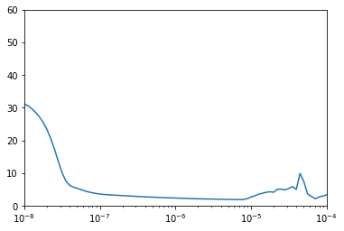
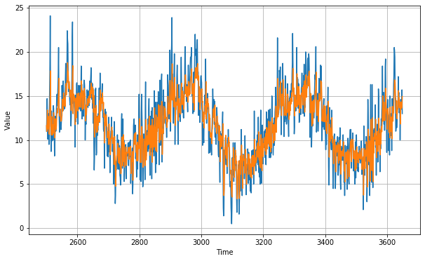

# Tensorflow Deveoper Certification
## Time Series_Exercise_4_Sunspots
** tensorflow version: 2.0.0-alpha0 **  
a real-world prediction
load CSV file and built models to use
data source: https://github.com/jbrownlee/Datasets
dataset: daily minimum temperatures in the city of Melbourne, Australia measured from 1981 to 1990
Your model should have an MAE of less than 2, you need to try to beat the 1.78~!


```python
import tensorflow as tf
import numpy as np
import matplotlib.pyplot as plt
print(tf.__version__)
```

    2.0.0-alpha0
    


```python
def plot_series(time, series, format ='-', start=0, end = None):
    plt.plot(time[start:end], series[start:end], format)
    plt.xlabel('Time')
    plt.ylabel('Value')
    plt.grid(True)

```


```python
import csv
time_step = []
temps = []

working_path = 'C:\\Users\\uidv6361\\machine_learning_basic\\'
with open(working_path + 'daily-min-temperatures.csv') as csvfile: 
    reader = csv.reader(csvfile, delimiter = ',')
    next(reader)
    step = 0
    for row in reader: 
        temps.append(float(row[1]))
        time_step.append(step)
        step = step+1
series = np.array(temps)
time = np.array(time_step)
plt.figure(figsize = (10,6))
plot_series(time, series)
```


```python
split_time = 2500
time_train = time[:split_time]
x_train = series[:split_time]
time_valid = time[split_time:]
x_valid = series[split_time:]

window_size = 30
batch_size = 32
shuffle_buffer_size = 1000
```


```python
def windowed_dataset(series, window_size, batch_size, shuffle_buffer):
    
    # before processing, we need to expand dimensions of the series before process it
    series = tf.expand_dims(series, axis = -1)
    
    ds = tf.data.Dataset.from_tensor_slices(series)
    ds = ds.window(window_size+1, shift =1, drop_remainder = True)
    ds = ds.flat_map(lambda w: w.batch(window_size +1))
    ds = ds.shuffle(shuffle_buffer)
    ds = ds.map(lambda w: (w[:-1], w[1:]))
    return ds.batch(batch_size).prefetch(1)
```


```python
def model_forecast(model, series, window_size):
    ds = tf.data.Dataset.from_tensor_slices(series)
    ds = ds.window(window_size, shift=1, drop_remainder = True)
    ds = ds.flat_map(lambda w : w.batch(window_size))
    ds = ds.batch(32).prefetch(1)
    forecast = model.predict(ds)
    return forecast
```

### convolutional layer added to LSTM layers


```python
tf.keras.backend.clear_session()
tf.random.set_seed(51)
np.random.seed(51)
window_size = 64
batch_size = 256
train_set = windowed_dataset(x_train, window_size, batch_size, shuffle_buffer_size)
print(train_set)
print(x_train.shape)

model = tf.keras.models.Sequential([
    tf.keras.layers.Conv1D(filters = 32, kernel_size = 5, strides = 1, padding = 'causal', 
                          activation = 'relu', input_shape = [None, 1]), 
    tf.keras.layers.LSTM(64, return_sequences = True), 
    tf.keras.layers.LSTM(64, return_sequences = True),
    tf.keras.layers.Dense(30, activation = 'relu'), 
    tf.keras.layers.Dense(10, activation = 'relu'), 
    tf.keras.layers.Dense(1), 
    tf.keras.layers.Lambda( lambda x : x * 400)
])
lr_schedule = tf.keras.callbacks.LearningRateScheduler(lambda epoch: 1e-8*10**(epoch/20))
optimizer = tf.keras.optimizers.SGD(lr = 1e-8, momentum=0.9)
model.compile(loss = tf.keras.losses.Huber(), optimizer = optimizer, metrics = ['mae'])
history = model.fit(train_set, epochs=100, callbacks = [lr_schedule])
```

    <PrefetchDataset shapes: ((None, None, 1), (None, None, 1)), types: (tf.float64, tf.float64)>
    (2500,)
    Epoch 1/100
    10/10 [==============================] - 8s 809ms/step - loss: 31.1549 - mae: 31.6551
    Epoch 2/100
    10/10 [==============================] - 3s 326ms/step - loss: 30.5696 - mae: 31.0771
    Epoch 3/100
    10/10 [==============================] - 3s 321ms/step - loss: 29.6691 - mae: 30.1811
    Epoch 4/100
    10/10 [==============================] - 3s 323ms/step - loss: 28.5431 - mae: 29.0596
    Epoch 5/100
    10/10 [==============================] - 3s 319ms/step - loss: 27.1744 - mae: 27.6977
    Epoch 6/100
    10/10 [==============================] - 3s 326ms/step - loss: 25.4676 - mae: 26.0016
    Epoch 7/100
    10/10 [==============================] - 3s 320ms/step - loss: 23.2987 - mae: 23.8488
    Epoch 8/100
    10/10 [==============================] - 3s 323ms/step - loss: 20.5506 - mae: 21.1192
    Epoch 9/100
    10/10 [==============================] - 3s 310ms/step - loss: 17.2409 - mae: 17.8224
    Epoch 10/100
    10/10 [==============================] - 3s 319ms/step - loss: 13.5549 - mae: 14.1351
    Epoch 11/100
    10/10 [==============================] - 3s 319ms/step - loss: 10.0754 - mae: 10.6367
    Epoch 12/100
    10/10 [==============================] - 3s 324ms/step - loss: 7.5638 - mae: 8.0986
    Epoch 13/100
    10/10 [==============================] - 3s 320ms/step - loss: 6.2445 - mae: 6.7619
    Epoch 14/100
    10/10 [==============================] - 3s 320ms/step - loss: 5.6749 - mae: 6.1854
    Epoch 15/100
    10/10 [==============================] - 3s 320ms/step - loss: 5.3090 - mae: 5.8168
    Epoch 16/100
    10/10 [==============================] - 3s 318ms/step - loss: 4.9122 - mae: 5.4169
    Epoch 17/100
    10/10 [==============================] - 3s 324ms/step - loss: 4.5318 - mae: 5.0305
    Epoch 18/100
    10/10 [==============================] - 3s 319ms/step - loss: 4.2115 - mae: 4.7068
    Epoch 19/100
    10/10 [==============================] - 3s 340ms/step - loss: 3.9429 - mae: 4.4360
    Epoch 20/100
    10/10 [==============================] - 3s 322ms/step - loss: 3.7309 - mae: 4.2194
    Epoch 21/100
    10/10 [==============================] - 3s 324ms/step - loss: 3.5706 - mae: 4.0551
    Epoch 22/100
    10/10 [==============================] - 3s 318ms/step - loss: 3.4527 - mae: 3.9344
    Epoch 23/100
    10/10 [==============================] - 3s 323ms/step - loss: 3.3617 - mae: 3.8423
    Epoch 24/100
    10/10 [==============================] - 3s 328ms/step - loss: 3.2876 - mae: 3.7666
    Epoch 25/100
    10/10 [==============================] - 4s 391ms/step - loss: 3.2224 - mae: 3.6997
    Epoch 26/100
    10/10 [==============================] - 3s 332ms/step - loss: 3.1596 - mae: 3.6359
    Epoch 27/100
    10/10 [==============================] - 3s 323ms/step - loss: 3.0964 - mae: 3.5717
    Epoch 28/100
    10/10 [==============================] - 3s 324ms/step - loss: 3.0322 - mae: 3.5064
    Epoch 29/100
    10/10 [==============================] - 3s 327ms/step - loss: 2.9662 - mae: 3.4392
    Epoch 30/100
    10/10 [==============================] - 3s 320ms/step - loss: 2.9004 - mae: 3.3720
    Epoch 31/100
    10/10 [==============================] - 3s 332ms/step - loss: 2.8376 - mae: 3.3081
    Epoch 32/100
    10/10 [==============================] - 3s 340ms/step - loss: 2.7775 - mae: 3.2475
    Epoch 33/100
    10/10 [==============================] - 3s 325ms/step - loss: 2.7202 - mae: 3.1899
    Epoch 34/100
    10/10 [==============================] - 3s 332ms/step - loss: 2.6662 - mae: 3.1360
    Epoch 35/100
    10/10 [==============================] - 3s 324ms/step - loss: 2.6152 - mae: 3.0848
    Epoch 36/100
    10/10 [==============================] - 3s 322ms/step - loss: 2.5663 - mae: 3.0353
    Epoch 37/100
    10/10 [==============================] - 3s 337ms/step - loss: 2.5192 - mae: 2.9872
    Epoch 38/100
    10/10 [==============================] - 3s 321ms/step - loss: 2.4735 - mae: 2.9408
    Epoch 39/100
    10/10 [==============================] - 3s 324ms/step - loss: 2.4296 - mae: 2.8964
    Epoch 40/100
    10/10 [==============================] - 3s 321ms/step - loss: 2.3873 - mae: 2.8534
    Epoch 41/100
    10/10 [==============================] - 3s 309ms/step - loss: 2.3463 - mae: 2.8119
    Epoch 42/100
    10/10 [==============================] - 3s 304ms/step - loss: 2.3060 - mae: 2.7707
    Epoch 43/100
    10/10 [==============================] - 3s 324ms/step - loss: 2.2663 - mae: 2.7301
    Epoch 44/100
    10/10 [==============================] - 3s 323ms/step - loss: 2.2269 - mae: 2.6899
    Epoch 45/100
    10/10 [==============================] - 3s 328ms/step - loss: 2.1898 - mae: 2.6519
    Epoch 46/100
    10/10 [==============================] - 3s 330ms/step - loss: 2.1563 - mae: 2.6181
    Epoch 47/100
    10/10 [==============================] - 3s 328ms/step - loss: 2.1248 - mae: 2.5861
    Epoch 48/100
    10/10 [==============================] - 3s 337ms/step - loss: 2.0958 - mae: 2.5568
    Epoch 49/100
    10/10 [==============================] - 3s 332ms/step - loss: 2.0688 - mae: 2.5296
    Epoch 50/100
    10/10 [==============================] - 3s 331ms/step - loss: 2.0442 - mae: 2.5045
    Epoch 51/100
    10/10 [==============================] - 3s 324ms/step - loss: 2.0220 - mae: 2.4818
    Epoch 52/100
    10/10 [==============================] - 3s 325ms/step - loss: 2.0018 - mae: 2.4611
    Epoch 53/100
    10/10 [==============================] - 3s 332ms/step - loss: 1.9802 - mae: 2.4393
    Epoch 54/100
    10/10 [==============================] - 3s 333ms/step - loss: 1.9586 - mae: 2.4171
    Epoch 55/100
    10/10 [==============================] - 3s 329ms/step - loss: 1.9390 - mae: 2.3972
    Epoch 56/100
    10/10 [==============================] - 3s 330ms/step - loss: 1.9186 - mae: 2.3763
    Epoch 57/100
    10/10 [==============================] - 3s 313ms/step - loss: 1.8974 - mae: 2.3550
    Epoch 58/100
    10/10 [==============================] - 3s 325ms/step - loss: 1.8741 - mae: 2.3318
    Epoch 59/100
    10/10 [==============================] - 3s 322ms/step - loss: 1.8743 - mae: 2.3316
    Epoch 60/100
    10/10 [==============================] - 3s 328ms/step - loss: 2.1513 - mae: 2.6180
    Epoch 61/100
    10/10 [==============================] - 3s 325ms/step - loss: 2.6769 - mae: 3.1254
    Epoch 62/100
    10/10 [==============================] - 3s 326ms/step - loss: 2.9947 - mae: 3.4821
    Epoch 63/100
    10/10 [==============================] - 3s 324ms/step - loss: 3.5242 - mae: 3.9891
    Epoch 64/100
    10/10 [==============================] - 3s 332ms/step - loss: 3.8235 - mae: 4.2911
    Epoch 65/100
    10/10 [==============================] - 3s 322ms/step - loss: 4.1290 - mae: 4.5890
    Epoch 66/100
    10/10 [==============================] - 3s 327ms/step - loss: 4.3070 - mae: 4.7674
    Epoch 67/100
    10/10 [==============================] - 3s 318ms/step - loss: 4.1933 - mae: 4.6018
    Epoch 68/100
    10/10 [==============================] - 3s 323ms/step - loss: 5.0191 - mae: 5.5081
    Epoch 69/100
    10/10 [==============================] - 3s 321ms/step - loss: 4.9816 - mae: 5.5629
    Epoch 70/100
    10/10 [==============================] - 3s 322ms/step - loss: 4.7727 - mae: 5.3561
    Epoch 71/100
    10/10 [==============================] - 3s 316ms/step - loss: 5.2396 - mae: 5.7444
    Epoch 72/100
    10/10 [==============================] - 3s 333ms/step - loss: 5.8943 - mae: 6.3486
    Epoch 73/100
    10/10 [==============================] - 3s 325ms/step - loss: 4.8853 - mae: 5.4916
    Epoch 74/100
    10/10 [==============================] - 3s 336ms/step - loss: 9.9791 - mae: 10.3726
    Epoch 75/100
    10/10 [==============================] - 3s 335ms/step - loss: 7.2035 - mae: 7.8645
    Epoch 76/100
    10/10 [==============================] - 3s 323ms/step - loss: 3.5616 - mae: 4.0582
    Epoch 77/100
    10/10 [==============================] - 3s 322ms/step - loss: 2.8364 - mae: 3.3244
    Epoch 78/100
    10/10 [==============================] - 3s 323ms/step - loss: 2.1299 - mae: 2.5944
    Epoch 79/100
    10/10 [==============================] - 3s 330ms/step - loss: 2.6471 - mae: 3.1340
    Epoch 80/100
    10/10 [==============================] - 3s 330ms/step - loss: 2.9407 - mae: 3.4319
    Epoch 81/100
    10/10 [==============================] - 3s 325ms/step - loss: 3.3064 - mae: 3.7961
    Epoch 82/100
    10/10 [==============================] - 3s 323ms/step - loss: 3.9603 - mae: 4.4262
    Epoch 83/100
    10/10 [==============================] - 3s 328ms/step - loss: 4.6321 - mae: 5.1083
    Epoch 84/100
    10/10 [==============================] - 4s 406ms/step - loss: 5.2696 - mae: 5.7705
    Epoch 85/100
    10/10 [==============================] - 4s 376ms/step - loss: 5.8810 - mae: 6.3911
    Epoch 86/100
    10/10 [==============================] - 3s 315ms/step - loss: 7.0394 - mae: 7.4985
    Epoch 87/100
    10/10 [==============================] - 3s 320ms/step - loss: 7.6896 - mae: 8.1320
    Epoch 88/100
    10/10 [==============================] - 3s 330ms/step - loss: 8.8802 - mae: 9.3282
    Epoch 89/100
    10/10 [==============================] - 3s 346ms/step - loss: 9.9375 - mae: 10.2565
    Epoch 90/100
    10/10 [==============================] - 3s 339ms/step - loss: 11.0777 - mae: 11.5738
    Epoch 91/100
    10/10 [==============================] - 4s 361ms/step - loss: 28.4552 - mae: 27.1080
    Epoch 92/100
    10/10 [==============================] - 3s 349ms/step - loss: 40.3009 - mae: 39.2437
    Epoch 93/100
    10/10 [==============================] - 3s 331ms/step - loss: 40.6381 - mae: 42.8065
    Epoch 94/100
    10/10 [==============================] - 3s 330ms/step - loss: 39.4763 - mae: 40.3072
    Epoch 95/100
    10/10 [==============================] - 3s 329ms/step - loss: 38.5388 - mae: 40.5624
    Epoch 96/100
    10/10 [==============================] - 3s 326ms/step - loss: 98.7359 - mae: 95.9122
    Epoch 97/100
    10/10 [==============================] - 3s 347ms/step - loss: 171.1200 - mae: 168.3848
    Epoch 98/100
    10/10 [==============================] - 4s 359ms/step - loss: 167.2062 - mae: 171.7022
    Epoch 99/100
    10/10 [==============================] - 3s 346ms/step - loss: 95.7712 - mae: 90.7173
    Epoch 100/100
    10/10 [==============================] - 4s 361ms/step - loss: 300.1659 - mae: 287.7912
    


```python
plt.semilogx(history.history['lr'], history.history['loss'])
plt.axis([1e-8, 1e-4, 0, 60])
```


    [1e-08, 0.0001, 0, 60]





```python
tf.keras.backend.clear_session()
tf.random.set_seed(51)
np.random.seed(51)
train_set = windowed_dataset(x_train, window_size=60, batch_size=100, shuffle_buffer=shuffle_buffer_size)
model = tf.keras.models.Sequential([
    tf.keras.layers.Conv1D(filters = 60, kernel_size = 5, 
                          strides =1, padding = 'causal', activation = 'relu', input_shape=[None, 1]), 
    tf.keras.layers.LSTM(60, return_sequences = True), 
    tf.keras.layers.LSTM(60, return_sequences = True), 
    tf.keras.layers.Dense(30, activation = 'relu'),
    tf.keras.layers.Dense(10, activation = 'relu'),
    tf.keras.layers.Dense(1), 
    tf.keras.layers.Lambda (lambda x: x * 400)
])

optimizer = tf.keras.optimizers.SGD(lr = 1e-5, momentum = 0.9)
model.compile(loss = tf.keras.losses.Huber(), optimizer = optimizer, metrics = ['mae'])
history = model.fit(train_set, epochs = 150)
```

    Epoch 1/150
    25/25 [==============================] - 7s 271ms/step - loss: 9.9624 - mae: 10.5789
    Epoch 2/150
    25/25 [==============================] - 4s 145ms/step - loss: 2.5390 - mae: 3.0130
    Epoch 3/150
    25/25 [==============================] - 4s 143ms/step - loss: 1.9265 - mae: 2.3815
    Epoch 4/150
    25/25 [==============================] - 3s 139ms/step - loss: 1.8597 - mae: 2.3125
    Epoch 5/150
    25/25 [==============================] - 4s 141ms/step - loss: 1.8181 - mae: 2.2696
    Epoch 6/150
    25/25 [==============================] - 4s 162ms/step - loss: 1.7882 - mae: 2.2385
    Epoch 7/150
    25/25 [==============================] - 4s 141ms/step - loss: 1.7618 - mae: 2.2112
    Epoch 8/150
    25/25 [==============================] - 4s 143ms/step - loss: 1.7382 - mae: 2.1870
    Epoch 9/150
    25/25 [==============================] - 4s 141ms/step - loss: 1.7167 - mae: 2.1650
    Epoch 10/150
    25/25 [==============================] - 4s 142ms/step - loss: 1.6976 - mae: 2.1454
    Epoch 11/150
    25/25 [==============================] - 3s 139ms/step - loss: 1.6808 - mae: 2.1281
    Epoch 12/150
    25/25 [==============================] - 4s 151ms/step - loss: 1.6661 - mae: 2.1128
    Epoch 13/150
    25/25 [==============================] - 4s 142ms/step - loss: 1.6531 - mae: 2.0993
    Epoch 14/150
    25/25 [==============================] - 4s 141ms/step - loss: 1.6417 - mae: 2.0872
    Epoch 15/150
    25/25 [==============================] - 4s 144ms/step - loss: 1.6315 - mae: 2.0764
    Epoch 16/150
    25/25 [==============================] - 4s 143ms/step - loss: 1.6223 - mae: 2.0667
    Epoch 17/150
    25/25 [==============================] - 4s 144ms/step - loss: 1.6141 - mae: 2.0579
    Epoch 18/150
    25/25 [==============================] - 4s 146ms/step - loss: 1.6067 - mae: 2.0500
    Epoch 19/150
    25/25 [==============================] - 4s 145ms/step - loss: 1.6000 - mae: 2.0429
    Epoch 20/150
    25/25 [==============================] - 4s 143ms/step - loss: 1.5939 - mae: 2.0364
    Epoch 21/150
    25/25 [==============================] - 4s 143ms/step - loss: 1.5883 - mae: 2.0306
    Epoch 22/150
    25/25 [==============================] - 4s 142ms/step - loss: 1.5833 - mae: 2.0254
    Epoch 23/150
    25/25 [==============================] - 4s 143ms/step - loss: 1.5787 - mae: 2.0207
    Epoch 24/150
    25/25 [==============================] - 4s 143ms/step - loss: 1.5745 - mae: 2.0163
    Epoch 25/150
    25/25 [==============================] - 4s 146ms/step - loss: 1.5707 - mae: 2.0124
    Epoch 26/150
    25/25 [==============================] - 4s 145ms/step - loss: 1.5672 - mae: 2.0088
    Epoch 27/150
    25/25 [==============================] - 4s 152ms/step - loss: 1.5640 - mae: 2.0056
    Epoch 28/150
    25/25 [==============================] - 4s 166ms/step - loss: 1.5610 - mae: 2.0026
    Epoch 29/150
    25/25 [==============================] - 4s 143ms/step - loss: 1.5583 - mae: 1.9998
    Epoch 30/150
    25/25 [==============================] - 4s 142ms/step - loss: 1.5558 - mae: 1.9972
    Epoch 31/150
    25/25 [==============================] - 4s 143ms/step - loss: 1.5534 - mae: 1.9949
    Epoch 32/150
    25/25 [==============================] - 4s 144ms/step - loss: 1.5512 - mae: 1.9927
    Epoch 33/150
    25/25 [==============================] - 4s 145ms/step - loss: 1.5491 - mae: 1.9906
    Epoch 34/150
    25/25 [==============================] - 4s 145ms/step - loss: 1.5472 - mae: 1.9886
    Epoch 35/150
    25/25 [==============================] - 4s 146ms/step - loss: 1.5453 - mae: 1.9868
    Epoch 36/150
    25/25 [==============================] - 4s 148ms/step - loss: 1.5436 - mae: 1.9850
    Epoch 37/150
    25/25 [==============================] - 4s 146ms/step - loss: 1.5419 - mae: 1.9833
    Epoch 38/150
    25/25 [==============================] - 4s 147ms/step - loss: 1.5404 - mae: 1.9817
    Epoch 39/150
    25/25 [==============================] - 4s 145ms/step - loss: 1.5389 - mae: 1.9803
    Epoch 40/150
    25/25 [==============================] - 4s 148ms/step - loss: 1.5376 - mae: 1.9789
    Epoch 41/150
    25/25 [==============================] - 4s 147ms/step - loss: 1.5363 - mae: 1.9776
    Epoch 42/150
    25/25 [==============================] - 4s 144ms/step - loss: 1.5350 - mae: 1.9764
    Epoch 43/150
    25/25 [==============================] - 4s 150ms/step - loss: 1.5338 - mae: 1.9752
    Epoch 44/150
    25/25 [==============================] - 4s 154ms/step - loss: 1.5327 - mae: 1.9741
    Epoch 45/150
    25/25 [==============================] - 4s 151ms/step - loss: 1.5316 - mae: 1.9729
    Epoch 46/150
    25/25 [==============================] - 4s 148ms/step - loss: 1.5305 - mae: 1.9719
    Epoch 47/150
    25/25 [==============================] - 4s 147ms/step - loss: 1.5295 - mae: 1.9708
    Epoch 48/150
    25/25 [==============================] - 4s 145ms/step - loss: 1.5286 - mae: 1.9698
    Epoch 49/150
    25/25 [==============================] - 4s 144ms/step - loss: 1.5276 - mae: 1.9689
    Epoch 50/150
    25/25 [==============================] - 4s 144ms/step - loss: 1.5267 - mae: 1.9680
    Epoch 51/150
    25/25 [==============================] - 4s 152ms/step - loss: 1.5259 - mae: 1.9672
    Epoch 52/150
    25/25 [==============================] - 4s 150ms/step - loss: 1.5251 - mae: 1.9664
    Epoch 53/150
    25/25 [==============================] - 4s 153ms/step - loss: 1.5243 - mae: 1.9656
    Epoch 54/150
    25/25 [==============================] - 4s 158ms/step - loss: 1.5235 - mae: 1.9648
    Epoch 55/150
    25/25 [==============================] - 4s 144ms/step - loss: 1.5228 - mae: 1.9640
    Epoch 56/150
    25/25 [==============================] - 4s 150ms/step - loss: 1.5221 - mae: 1.9633
    Epoch 57/150
    25/25 [==============================] - 4s 150ms/step - loss: 1.5213 - mae: 1.9626
    Epoch 58/150
    25/25 [==============================] - 4s 153ms/step - loss: 1.5207 - mae: 1.9619
    Epoch 59/150
    25/25 [==============================] - 4s 154ms/step - loss: 1.5200 - mae: 1.9611
    Epoch 60/150
    25/25 [==============================] - 3s 140ms/step - loss: 1.5193 - mae: 1.9604
    Epoch 61/150
    25/25 [==============================] - 4s 157ms/step - loss: 1.5186 - mae: 1.9597
    Epoch 62/150
    25/25 [==============================] - 4s 165ms/step - loss: 1.5180 - mae: 1.9590
    Epoch 63/150
    25/25 [==============================] - 4s 142ms/step - loss: 1.5173 - mae: 1.9583
    Epoch 64/150
    25/25 [==============================] - 4s 148ms/step - loss: 1.5167 - mae: 1.9576
    Epoch 65/150
    25/25 [==============================] - 4s 155ms/step - loss: 1.5161 - mae: 1.9570
    Epoch 66/150
    25/25 [==============================] - 4s 147ms/step - loss: 1.5155 - mae: 1.9564
    Epoch 67/150
    25/25 [==============================] - 4s 141ms/step - loss: 1.5149 - mae: 1.9558
    Epoch 68/150
    25/25 [==============================] - 3s 139ms/step - loss: 1.5143 - mae: 1.9551
    Epoch 69/150
    25/25 [==============================] - 4s 145ms/step - loss: 1.5136 - mae: 1.9544
    Epoch 70/150
    25/25 [==============================] - 4s 141ms/step - loss: 1.5129 - mae: 1.9536
    Epoch 71/150
    25/25 [==============================] - 4s 141ms/step - loss: 1.5123 - mae: 1.9529
    Epoch 72/150
    25/25 [==============================] - 3s 139ms/step - loss: 1.5116 - mae: 1.9522
    Epoch 73/150
    25/25 [==============================] - 4s 144ms/step - loss: 1.5109 - mae: 1.9515
    Epoch 74/150
    25/25 [==============================] - 4s 143ms/step - loss: 1.5103 - mae: 1.9508
    Epoch 75/150
    25/25 [==============================] - 4s 140ms/step - loss: 1.5097 - mae: 1.9503
    Epoch 76/150
    25/25 [==============================] - 4s 156ms/step - loss: 1.5091 - mae: 1.9498
    Epoch 77/150
    25/25 [==============================] - 4s 145ms/step - loss: 1.5085 - mae: 1.9491
    Epoch 78/150
    25/25 [==============================] - 4s 144ms/step - loss: 1.5079 - mae: 1.9485
    Epoch 79/150
    25/25 [==============================] - 4s 145ms/step - loss: 1.5073 - mae: 1.9479
    Epoch 80/150
    25/25 [==============================] - 4s 142ms/step - loss: 1.5066 - mae: 1.9472
    Epoch 81/150
    25/25 [==============================] - 4s 143ms/step - loss: 1.5059 - mae: 1.9466
    Epoch 82/150
    25/25 [==============================] - 3s 139ms/step - loss: 1.5054 - mae: 1.9459
    Epoch 83/150
    25/25 [==============================] - 4s 144ms/step - loss: 1.5048 - mae: 1.9454
    Epoch 84/150
    25/25 [==============================] - 4s 141ms/step - loss: 1.5043 - mae: 1.9449
    Epoch 85/150
    25/25 [==============================] - 3s 139ms/step - loss: 1.5038 - mae: 1.9444
    Epoch 86/150
    25/25 [==============================] - 3s 139ms/step - loss: 1.5033 - mae: 1.9439
    Epoch 87/150
    25/25 [==============================] - 3s 138ms/step - loss: 1.5028 - mae: 1.9433
    Epoch 88/150
    25/25 [==============================] - 3s 137ms/step - loss: 1.5023 - mae: 1.9428
    Epoch 89/150
    25/25 [==============================] - 3s 140ms/step - loss: 1.5018 - mae: 1.9423
    Epoch 90/150
    25/25 [==============================] - 3s 137ms/step - loss: 1.5013 - mae: 1.9418
    Epoch 91/150
    25/25 [==============================] - 3s 138ms/step - loss: 1.5007 - mae: 1.9411
    Epoch 92/150
    25/25 [==============================] - 3s 138ms/step - loss: 1.4997 - mae: 1.9401
    Epoch 93/150
    25/25 [==============================] - 3s 136ms/step - loss: 1.4985 - mae: 1.9389
    Epoch 94/150
    25/25 [==============================] - 3s 136ms/step - loss: 1.4977 - mae: 1.9380
    Epoch 95/150
    25/25 [==============================] - 3s 138ms/step - loss: 1.4970 - mae: 1.9372
    Epoch 96/150
    25/25 [==============================] - 3s 139ms/step - loss: 1.4963 - mae: 1.9366
    Epoch 97/150
    25/25 [==============================] - 3s 137ms/step - loss: 1.4957 - mae: 1.9359
    Epoch 98/150
    25/25 [==============================] - 3s 138ms/step - loss: 1.4950 - mae: 1.9352
    Epoch 99/150
    25/25 [==============================] - 3s 137ms/step - loss: 1.4944 - mae: 1.9345
    Epoch 100/150
    25/25 [==============================] - 3s 140ms/step - loss: 1.4937 - mae: 1.9338
    Epoch 101/150
    25/25 [==============================] - 3s 140ms/step - loss: 1.4929 - mae: 1.9330
    Epoch 102/150
    25/25 [==============================] - 3s 138ms/step - loss: 1.4921 - mae: 1.9322
    Epoch 103/150
    25/25 [==============================] - 3s 137ms/step - loss: 1.4914 - mae: 1.9314
    Epoch 104/150
    25/25 [==============================] - 3s 139ms/step - loss: 1.4909 - mae: 1.9308
    Epoch 105/150
    25/25 [==============================] - 3s 137ms/step - loss: 1.4904 - mae: 1.9303
    Epoch 106/150
    25/25 [==============================] - 4s 144ms/step - loss: 1.4900 - mae: 1.9298
    Epoch 107/150
    25/25 [==============================] - 3s 139ms/step - loss: 1.4896 - mae: 1.9294
    Epoch 108/150
    25/25 [==============================] - 4s 141ms/step - loss: 1.4892 - mae: 1.9290
    Epoch 109/150
    25/25 [==============================] - 4s 155ms/step - loss: 1.4888 - mae: 1.9286
    Epoch 110/150
    25/25 [==============================] - 4s 154ms/step - loss: 1.4885 - mae: 1.9282
    Epoch 111/150
    25/25 [==============================] - 4s 171ms/step - loss: 1.4881 - mae: 1.9279 1s - loss: 1.5122 - m
    Epoch 112/150
    25/25 [==============================] - 4s 153ms/step - loss: 1.4878 - mae: 1.9275
    Epoch 113/150
    25/25 [==============================] - 4s 141ms/step - loss: 1.4875 - mae: 1.9272
    Epoch 114/150
    25/25 [==============================] - 4s 153ms/step - loss: 1.4871 - mae: 1.9268
    Epoch 115/150
    25/25 [==============================] - 4s 151ms/step - loss: 1.4868 - mae: 1.9265
    Epoch 116/150
    25/25 [==============================] - 4s 151ms/step - loss: 1.4865 - mae: 1.9262
    Epoch 117/150
    25/25 [==============================] - 4s 142ms/step - loss: 1.4862 - mae: 1.9259
    Epoch 118/150
    25/25 [==============================] - 3s 139ms/step - loss: 1.4859 - mae: 1.9255
    Epoch 119/150
    25/25 [==============================] - 3s 140ms/step - loss: 1.4856 - mae: 1.9252
    Epoch 120/150
    25/25 [==============================] - 3s 137ms/step - loss: 1.4854 - mae: 1.9249
    Epoch 121/150
    25/25 [==============================] - 3s 138ms/step - loss: 1.4851 - mae: 1.9246
    Epoch 122/150
    25/25 [==============================] - 3s 140ms/step - loss: 1.4848 - mae: 1.9243
    Epoch 123/150
    25/25 [==============================] - 3s 139ms/step - loss: 1.4845 - mae: 1.9241
    Epoch 124/150
    25/25 [==============================] - 4s 141ms/step - loss: 1.4843 - mae: 1.9238
    Epoch 125/150
    25/25 [==============================] - 3s 139ms/step - loss: 1.4840 - mae: 1.9235
    Epoch 126/150
    25/25 [==============================] - 4s 141ms/step - loss: 1.4837 - mae: 1.9232
    Epoch 127/150
    25/25 [==============================] - 4s 141ms/step - loss: 1.4835 - mae: 1.9230
    Epoch 128/150
    25/25 [==============================] - 3s 136ms/step - loss: 1.4833 - mae: 1.9227
    Epoch 129/150
    25/25 [==============================] - 4s 160ms/step - loss: 1.4831 - mae: 1.9225
    Epoch 130/150
    25/25 [==============================] - 4s 155ms/step - loss: 1.4828 - mae: 1.9222
    Epoch 131/150
    25/25 [==============================] - 4s 145ms/step - loss: 1.4826 - mae: 1.9220
    Epoch 132/150
    25/25 [==============================] - 4s 149ms/step - loss: 1.4823 - mae: 1.9217
    Epoch 133/150
    25/25 [==============================] - 4s 149ms/step - loss: 1.4820 - mae: 1.9214
    Epoch 134/150
    25/25 [==============================] - 4s 142ms/step - loss: 1.4818 - mae: 1.9212
    Epoch 135/150
    25/25 [==============================] - 4s 140ms/step - loss: 1.4816 - mae: 1.9209
    Epoch 136/150
    25/25 [==============================] - 4s 140ms/step - loss: 1.4813 - mae: 1.9207
    Epoch 137/150
    25/25 [==============================] - 4s 142ms/step - loss: 1.4811 - mae: 1.9204
    Epoch 138/150
    25/25 [==============================] - 3s 137ms/step - loss: 1.4808 - mae: 1.9201
    Epoch 139/150
    25/25 [==============================] - 4s 141ms/step - loss: 1.4806 - mae: 1.9199
    Epoch 140/150
    25/25 [==============================] - 4s 156ms/step - loss: 1.4804 - mae: 1.9197
    Epoch 141/150
    25/25 [==============================] - 4s 141ms/step - loss: 1.4802 - mae: 1.9194
    Epoch 142/150
    25/25 [==============================] - 4s 148ms/step - loss: 1.4799 - mae: 1.9192
    Epoch 143/150
    25/25 [==============================] - 4s 144ms/step - loss: 1.4797 - mae: 1.9189
    Epoch 144/150
    25/25 [==============================] - 4s 148ms/step - loss: 1.4795 - mae: 1.9187
    Epoch 145/150
    25/25 [==============================] - 4s 149ms/step - loss: 1.4793 - mae: 1.9185
    Epoch 146/150
    25/25 [==============================] - 4s 148ms/step - loss: 1.4791 - mae: 1.9183
    Epoch 147/150
    25/25 [==============================] - 4s 146ms/step - loss: 1.4789 - mae: 1.9181
    Epoch 148/150
    25/25 [==============================] - 4s 142ms/step - loss: 1.4787 - mae: 1.9178
    Epoch 149/150
    25/25 [==============================] - 4s 144ms/step - loss: 1.4785 - mae: 1.9176
    Epoch 150/150
    25/25 [==============================] - 3s 139ms/step - loss: 1.4783 - mae: 1.9174
    


```python
rnn_forecast = model_forecast(model, series[..., np.newaxis], window_size)
rnn_forecast = rnn_forecast[split_time - window_size: -1, -1, 0]
```


```python
plt.figure(figsize = (10,6))
plot_series(time_valid, x_valid)
plot_series(time_valid, rnn_forecast)
```





```python

```
